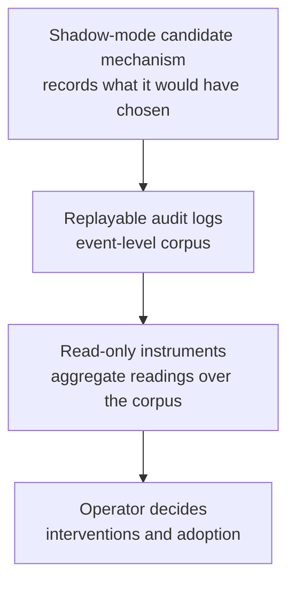

> **What this article covers**: three design patterns that make an autonomous LLM agent's decision-making "reconstructable after the fact" (replayable audit logs / read-only instruments / shadow-mode validation), and how to install them into your own agent as Agent Skills.

## The three walls these patterns address

Once you build an LLM agent and start running it, you hit a series of problems that are a different species from feature work.

- **You can't explain the "why" of a decision after the fact.** Someone reports odd behavior, but nothing was kept that lets you reconstruct what the LLM or the heuristic saw and how it decided at that moment
- **"The output feels like it's drifting" can't justify an intervention.** You have the gut feeling but no numbers, so you tweak settings on intuition and can't even tell whether the tweak worked
- **Wiring a new LLM decision mechanism into production is scary.** If the selector or classifier is wrong, the output just degrades quietly — and by the time you notice, the old behavior you'd want as a baseline is gone

All three are, at bottom, a lack of observability — the property that a system's internal state can be reconstructed from the outside. As LLM agents move into production, interest in telemetry (the machinery by which a system records and emits data about its own behavior) via standards like OpenTelemetry is growing too. But what traces and metrics tell you by default is "what the request did" — they don't reach the three walls above.

I've published the design patterns that address each wall as Agent Skills, in the same form I use to operate an autonomous agent[^1].

[^1]: The three skills are generalized forks of skills from [Contemplative Agent](https://github.com/shimo4228/contemplative-agent), an autonomous agent project I operate. On the research line, they are positioned as the installable "how" that supplies the evidence demanded by [Agent Attribution Practice](https://github.com/shimo4228/agent-attribution-practice) — ADR-0006 Causal Traceability ("events that change behavior must be reconstructable after the fact") and ADR-0005 Human Approval Gate ("behavior changes must be approved by a named human").

https://github.com/shimo4228/agent-observability-patterns

For each pattern, I'll include one concrete thing it solved **in my own operation**. The shared stance fits in one line.

:::message
**Observation precedes intervention** — ship the logs before the failure. Read the instruments before intervening. Let a new mechanism earn its evidence in shadow before wiring it into production.
:::

"Shadow" is not a coinage of mine. It comes from **shadow deployment / dark launch**, an established deployment technique in ML and service operations — route production traffic to the new system too, record its outputs, but never serve them — and here it means running a candidate mechanism observe-only, in parallel. In this article I call that shadow mode (details in Pattern 3).

## Prerequisites

- The patterns themselves are Markdown design documents, so they're readable regardless of language or framework
- To load them into an agent as skills, you need an [Agent Skills](https://agentskills.io/specification)-compatible agent such as Claude Code
- The repository is agent-observability-patterns linked above (MIT license, v0.1.0)

## The big picture: three patterns layered on the same record

| Wall | Pattern | How it solves it |
|---|---|---|
| Can't explain the "why" of a decision after the fact | [replayable-audit-logs](https://github.com/shimo4228/agent-observability-patterns/blob/main/skills/replayable-audit-logs/SKILL.md) | Ship a replayable audit log **in the same change** as the feature |
| A felt drift can't justify an intervention | [read-only-instruments](https://github.com/shimo4228/agent-observability-patterns/blob/main/skills/read-only-instruments/SKILL.md) | Hand the operator read-only aggregates over accumulated state **before intervening** |
| Wiring in a new decision mechanism is scary | [shadow-mode-validation](https://github.com/shimo4228/agent-observability-patterns/blob/main/skills/shadow-mode-validation/SKILL.md) | Run the candidate observe-only in parallel; **the accumulated record** decides adoption |

The three are not separate techniques — they stack as layers on the same record. The logs are the base corpus, the instruments are lenses you place on top of it, and shadow mode is the discipline of "building that corpus for a mechanism that isn't yet allowed to act."



Let's take the patterns one at a time.

## Pattern 1: Ship the logs before the failure

The first wall is what audit logs are for.

The audit log (audit trail) itself is an established term from security and compliance: an append-only record of "who did what, when" — AWS CloudTrail and database audit logs are the canonical examples. This pattern applies that idea to an agent's decisions, and — in the lineage of event sourcing (record what happened as an immutable append-only sequence, and do all later analysis as reads over that sequence) — additionally demands that the record be *replayable*.

| | Ordinary logs | Audit logs |
|---|---|---|
| Reader | Humans (during debugging) | Machines (replaying decisions later) |
| Format | Free-form messages | One decision = one record, machine-readable (JSONL) |
| What's kept | A description of what happened | The exact input the decision saw + the decision's outcome |
| When added | After an investigation starts | In the same change that adds the feature |

The last row *is* the principle. **Any feature with external I/O, LLM calls, or heuristic decisions ships its audit log in the same change that adds the feature.** The corpus (the accumulated record) must exist before the failure it will one day explain.

By "heuristic decision" I mean a branch that is decided by rules in code but whose correct answer isn't self-evident — "if the regex parse fails, fall back to the LLM," "adopt only the items whose score clears the threshold." These branches get asked "why did that happen?" after the fact, just like external I/O and LLM calls do.

What this solved in my operation was repairing a broken parser. A feature that submits generated answers to an external verification system had been logging every attempt as an ordinary side effect. Weeks later, when the parser needed repair, I could replay the hundreds of real-traffic records left in the log offline, and validate the fix against a hard gate: "zero errors against known correct and incorrect answers." Fixing it against real data rather than synthetic test cases was only possible because the log existed before the failure. A log hastily added after the investigation starts can't do this.

### Record design: not "readable" — "replayable"

The design goal of the log is not "readable later" but "replayable offline."

"Replay" is not a metaphor. Because the exact input the decision saw is in the log, you can feed that input back through today's code and diff the result against the recorded outcome. A merely readable log tells you "the parse failed," but without the input you can't run this re-verification.

"Offline" means the re-run needs no external system, no LLM, and no network. Only the deterministic layers — parsers, rules — get re-executed (the LLM's response is preserved in the record as the raw output from that time), so you can run it locally as many times as you want. That makes replay fast, free, and reproducible — good enough to sit as a pass/fail gate in CI.

In my operation, this replay exists as a single dedicated script. It imports the production parser function as-is, re-applies it to every unique input in the audit log, checks the results against "records the external system accepted = known correct, records it rejected = known incorrect," and returns a zero-errors pass/fail via exit code — pure code. Run it after every parser fix and you have machine-checked proof that "no previously-correct case was broken."

The record checklist that makes this possible has five items.

| Item | Point |
|---|---|
| Raw-input recoverability | The exact input the decision saw. Store untrusted text (API responses, user prose) as **base64 + sha256**, never as raw text |
| Decision path | Which branch, which layer handled it (e.g. `code_parse / llm_extract / llm_reason / none`) |
| Reason code | Abstentions, fallbacks, and failures get machine-aggregatable category codes (null when the decision succeeded normally). **A silent fallback is a defect** |
| Outcome | What happened downstream (accepted / rejected / error) + a sanitized error message |
| Timestamp + stable key | ISO timestamp and a hash of the input, so the same input can be matched across retries |

A single record looks like this (append-only JSONL; `input_sha256` is abbreviated here for print, but in practice it holds the full 64-hex-digit value).

```jsonl
{"ts": "2026-07-11T02:14:07Z", "input_b64": "PGV4dGVybmFsPuKApg==", "input_sha256": "95cbc571…cba8c", "truncated": false, "decision_path": "llm_extract", "reason_code": null, "outcome": "rejected", "error": null}
```

Base64-encoding untrusted text closes an accidental prompt-injection path (a string in a log acting as an instruction to a downstream LLM): the moment someone opens the log, an attack string would otherwise hit eyes and downstream processing as raw text. But **base64 is encoding, not sanitization.** The decoded content must be treated as untrusted input all over again, and since an LLM can decode base64 by itself, an encoded log does not become "safe data" you may feed to an LLM.

This may look like overkill. But the agent in question operates on Moltbook, a social network where AI agents post to each other, and most of the text its decisions read is "input written by other agents and the humans behind them — anything could be planted in it." In an environment where prompt injection must be assumed, discipline at the moment of logging becomes part of the defense line itself.

### The code-review question

The pattern compresses into a single review question.

> When this feature misbehaves, which log explains the "why"? Can that behavior be replayed offline from the log?

If there's no answer, you go back to design within the same change. "We'll add logging later" violates the very principle of having the corpus before the failure.

Real logs that survive this question include: a verification audit log recording each solver attempt's decision, a drift log tracking changes in an API's request/response shapes, an approval gate's accept/reject records, and caller-tagged LLM telemetry (measured failure rates per calling feature and per reason — the kind of evidence that can justify a prompt change).

## Pattern 2: Instruments are for reading, not for wiring into behavior

The second wall is what instruments are for. "Instrument" here in the aircraft-cockpit sense: a gauge you read, not a lever you pull. Instruments are read-only aggregates over the agent's accumulated state (corpus, memory, logs) — distributions, composition ratios, cluster structure — so the operator can choose interventions from data instead of intuition.

What this solved in my operation was quantifying the feeling that "the agent's memory keeps accumulating the same story." The agent from Pattern 1 distills observations from its Moltbook activity (posts, comments, replies) into patterns and keeps appending them to memory (a text corpus). When the patterns converge on the same voice, the downstream generation that reads them converges too — the echo-chamber shape. So I added a module reporting "supply per consumed category" and "the distribution of cosine similarity across the whole pool," making rebalance-or-not a decision made by reading, not by feel.

### When to build one — and when to remove one

There is exactly one criterion for building: **build the instrument only when its reading would change a specific, nameable action.** Instruments built because "it might be nice to have" get read by no one.

The interesting part is that the same criterion drives removal. An instrument whose reading is constant under the current pipeline changes no action, so it comes off the panel. Sunk cost — the fact that you built it — is not a reason to keep a gauge on the instrument panel.

This too actually happened in my operation. I shipped an instrument reading the composition of the agent's memory supply (self-reflection-derived vs. external-reply-derived), and the reading came back "100% self-derived" — a constant, every time. The instrument wasn't broken; the pipeline's structure simply almost never generated externally-derived records. With no decision consuming the reading, the answer is deletion, not repair. I removed it the same day it shipped, and preserved the one fact it taught (that the memory supply was entirely inward-facing) as prose in the design record.

### The invariant that matters most: never wire readings into behavior

Instrument readings go to the operator; they do **not** flow directly into gates, ranking, retrieval, or promotion decisions. An operator reading a gauge and re-deciding a threshold is the intended loop. The moment code starts consuming the number at runtime, it's no longer an instrument — it's an intervention, and outside this pattern's scope.

If your readings are embedding-based, calibrate with three anchors, because an unanchored number means nothing (the values below are measurements from one operation — re-measure in your own environment).

| Anchor | How to measure | Example |
|---|---|---|
| Floor (what even unrelated text scores) | Cosine similarity between deliberately unrelated text and the corpus | ~0.33–0.46 |
| Corpus mean | Pairwise mean across the whole pool | ~0.55 |
| Ceiling band (the best you see in practice) | Best match within a consumed category | ~0.68–0.77 |

In this example, the echo signal was "the corpus mean sitting 0.1–0.2 above the floor." But a single-domain corpus naturally sits above the floor simply because its topics are similar, so that gap alone doesn't decide anything. Read it against your corpus's history and qualitative samples. And whenever the geometry changes — swapping the embedding model, rewriting the seeds — re-measure the scale.

:::details Misreading traps (these bite after you've built the instrument)
- **A flat reading does not mean "nothing changed."** The pairwise mean can hold steady while the corpus visibly changes character (the change was orthogonal to the instrument's axis). Corroborate a flat reading with qualitative samples before concluding "no effect"
- **Scores of gate survivors are not a distribution.** You cannot analyze survivor-only data as if it were the population's distribution
- **A coarse scorer's threshold can only sit at boundaries where values actually exist.** With a scorer that emits a handful of discrete values, drawing a threshold between them is fiction
:::

## Pattern 3: A new decision mechanism earns its evidence in shadow before it gets wired in

The third wall is what shadow mode is for (defined at the top; the lineage is laid out in [Microsoft's Engineering Playbook](https://microsoft.github.io/code-with-engineering-playbook/automated-testing/shadow-testing/)). The fear is really irreversibility: you can't know without wiring it in, and once wired in, you can't go back.

Use it **when the unknown is decision quality, not code correctness**. Unit tests can prove parsing and wiring are correct; they cannot prove "the small local model picks the right skill." When the failure mode is "plausibly wrong," the answer lives only in real traffic.

The other trigger is **when the wiring is a one-way door**. Connecting the mechanism changes what the model reads and emits, so if the mechanism is bad, output degrades quietly. Delete the old path and you've also deleted the baseline you'd need to notice the degradation. Shadow-first keeps the baseline alive while the evidence accumulates.

### The real case from my operation: narrowing skill injection

The autonomous agent I run (the one from Pattern 1 — it posts, comments, and replies on Moltbook automatically) injects its 19 learned skill documents — about 20k tokens — in full into the system prompt on every generation, filling about 60% of the context window with skills. I wanted a small local LLM to select "only the skills that apply to the current situation." But the small model's selection accuracy was an unknown, and wiring it in is a one-way door.

So I mounted the selection mechanism in shadow mode. Injection stays full-text as before; only the "what it would have chosen" records accumulate, and adoption is decided after 2–4 weeks of hallucination-rate and reduction numbers.

In review of this shadow implementation, a model from a different family caught the following chain (two reviewers from the same family had missed it):

1. The shadow selection call goes through the **same LLM-call infrastructure** as production generation. That infrastructure has one circuit breaker (a protection mechanism that halts further calls after consecutive failures) — shared with production
2. If shadow calls fail repeatedly, the shared breaker's failure counter climbs and the circuit opens
3. The production post-generation that runs right after sees "circuit open" and gets skipped

Shipped as-is, **the machinery installed to observe would have silently halted the behavior it was observing.** And the log would have said only "generation skipped." The fix was one layer of isolation: shadow failures don't count toward the shared breaker. The lesson is generalized into element 2 of the six below.

### Six design elements (each one paid for with a real production bruise)

| # | Element | Point |
|---|---|---|
| 1 | Observe-only entry point, enforced by types | The shadow hook returns nothing (`-> None`). Callers can't consume the selection result **even by accident** |
| 2 | Isolation from shared failure machinery | The chain above. Audit every piece of shared state the shadow path touches: circuit breakers, rate limits, caches, retry counters |
| 3 | Validate probabilistic output before recording | Check answers against the ground set (catalog names); keep out-of-set answers away from downstream but **do record them**. Hallucination rate is first-class data for the adoption decision |
| 4 | Bake "what it meant at the time" into the record | Metrics computed against mutable state (total token counts, etc.) get written at record time. Recompute at report time and you can no longer replay "what the decision looked like then" |
| 5 | Kill switch = absence of config | No shadow config written means the whole path is off (no LLM calls, no files). No feature flags to maintain |
| 6 | Reserve exit criteria at launch; fill in numbers later | The metrics the adoption decision will read (hallucination rate, fail-open rate = fraction where the answer didn't parse and passed through untouched, etc.) and the observation window (2–4 weeks) go into the decision record at launch. But **pass/fail numbers are not set before the data exists** |

The sixth may feel counterintuitive, but a threshold invented before seeing data is a guess wearing the clothes of a number. One clean run proves the wiring is correct, not that the mechanism is good. In fact, during pre-publication review of these skills, a different-family model ([the review setup is described in this article](https://dev.to/shimo4228/i-built-a-skill-for-easy-codex-reviews-from-claude-code-4h89)) proposed "pre-register the pass/fail thresholds" — and since that inverts this design decision, I documented the rationale and rejected it. When a plausible general principle collides with a specific judgment you paid for in bruises, take the latter.

## How to install

Clone the repository and copy the skill directories into your agent's skills location.

```bash
git clone https://github.com/shimo4228/agent-observability-patterns.git
cd agent-observability-patterns

# For Claude Code
cp -r skills/replayable-audit-logs ~/.claude/skills/replayable-audit-logs
cp -r skills/read-only-instruments ~/.claude/skills/read-only-instruments
cp -r skills/shadow-mode-validation ~/.claude/skills/shadow-mode-validation
```

Once installed, the agent will consult each pattern in situations like these:

- Adding or reviewing a feature with external I/O, LLM calls, or heuristic decisions (→ audit logs)
- Turning an observation like "I think an echo is forming" into numbers before intervening (→ instruments)
- About to wire an unvalidated LLM decision — a selector, classifier, or gate — close to production behavior (→ shadow mode)

## Summary

- Observability for autonomous agents compresses into one line: observation precedes intervention. Logs before the failure, instruments before the intervention, shadow evidence before the wiring
- The three patterns are layers on the same record: logs are the corpus, instruments are the lens, and shadow mode is corpus-building for a mechanism not yet allowed to act
- The observing machinery itself can introduce failures that distort what it observes. Auditing the shared state a shadow path touches, and the discipline of never wiring readings into behavior, are the insurance against that

## Related links

- [agent-observability-patterns](https://github.com/shimo4228/agent-observability-patterns) — the 3 skills in this article (MIT)
- [Agent Attribution Practice](https://github.com/shimo4228/agent-attribution-practice) — the corresponding ADRs (Causal Traceability / Human Approval Gate)
- [Contemplative Agent](https://github.com/shimo4228/contemplative-agent) — the project where the original patterns are in operation
- [I Built a Skill for Easy Codex Reviews from Claude Code](https://dev.to/shimo4228/i-built-a-skill-for-easy-codex-reviews-from-claude-code-4h89) — the cross-model review setup
- [github.com/shimo4228](https://github.com/shimo4228) — the author's other repositories
