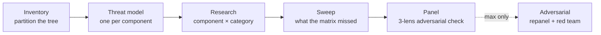

> **What this article covers**: A measured run of Anthropic's official security-scanning plugin `claude-security` (beta). What the tool does, how long it takes, what output it returns, and how far you can trust it — backed by the raw data from the run's own artifacts.

You may know the official plugin exists and still not have tried it, for reasons like these:

- **The cost is unreadable.** It warns you at startup that it "may take a while and use a significant number of tokens," but never says how much
- **The output quality is unknown.** How is this different from existing static analysis, and does an LLM that only reads code produce findings you can act on?
- **It's unclear what to do afterward.** If dozens of findings come back, where do you start?

On 2026-07-25 I installed v0.10.0 and scanned my entire `~/.claude` configuration set (hooks, skills, agents, permission settings). **189 subagents ran for two hours and returned 20 findings.** This article is that measurement.

:::message
This plugin is in beta as of 2026-07 (the version number is 0.10.0). Every number and behavior below is measured on v0.10.0 and may change.
:::

## Prerequisites

| Item | Requirement |
|---|---|
| Claude Code | Measured on 2.1.220 |
| Plugin | `claude-security` v0.10.0 (by Anthropic, marketplace `claude-plugins-official`) |
| Python | python3 3.9+ (used by the report-generation scripts) |
| git | Change scans require a git checkout. Whole-repository scans work without git |
| Permission mode | auto mode recommended (the plugin says so itself) |

This plugin is the "runs inside your session" version of the hosted [Claude Security](https://claude.com/product/claude-security) product. It starts no separate process and no daemon; it runs entirely inside your Claude Code session.

## What the tool is, and what happens when you run it

### From install to launch

```bash
# Run these inside a Claude Code session
/plugin install claude-security@claude-plugins-official
/reload-plugins
```

If it reports that the marketplace was not found, run `/plugin marketplace add anthropics/claude-plugins-official` first and retry.

After installing, `/claude-security` opens a menu offering three jobs.

| Job | Target | Duration |
|---|---|---|
| **Scan codebase** | The whole repository, or a scoped part of it | Depends on size (2 hours 1 minute in my run) |
| **Scan changes** | A branch diff, a pull request diff, or a single commit | Minutes for a small diff |
| **Suggest patches** | Turns an existing report's findings into patch files | Depends on the finding count |

You can also skip the menu and name the job in the arguments.

```text
/claude-security scan my branch's changes
/claude-security --base main
/claude-security 3cb30d2          # a hex string of 7+ chars is read as a commit SHA
```

### Get the confirmation prompt out of the way

Choosing a whole-repository scan always triggers this confirmation.

> This scan may take a while and may use a significant number of tokens. You will need to leave Claude Code open while the scan completes. Are you sure you want to continue?

Accept the cost up front and you go straight in. The check is not a literal string match — it asks whether your request already reads as accepting the time and token cost — so include a sentence that conveys that.

```text
/claude-security scan this repository — whole codebase.
I understand it may take a while and use a significant number of tokens.
```

:::message
You do need to leave Claude Code open while the scan runs. No interaction is required, so you can walk away.
:::

### Effort changes how much it searches, not how hard it verifies

`--effort` has four tiers. The distinctive design choice here: **the verification panel is fixed at three voters at every tier.**

| effort | What it does |
|---|---|
| `low` | One researcher over the whole repository. No inventory, threat model, or breadth sweep |
| `medium` (default) | The full workflow: inventory → threat model → one researcher per component × category → one sweep → three-voter panel |
| `high` | Like `medium`, but the component cap rises to 24, two researchers per cell, two sweeps |
| `max` | Like `high`, plus an adversarial phase: marginal keeps are re-panelled and every survivor faces a red team |

So dropping the tier does not mean "wave things through" — it means "search a narrower area." The documentation says as much, noting that the report's confidence figures are calibrated against that three-voter panel. I ran `medium`.

### A six-stage pipeline runs



Here is what that came to against `~/.claude`.

| Stage | Agents | Detail |
|---|---|---|
| Inventory | 1 | Partitioned the tree into 11 components |
| Threat model | 11 | One per component |
| Research + Sweep | 42 | One per component × category cell; the sweep is counted in this same pool |
| Panel | 135 | 45 candidates × 3 votes |
| **Total** | **189** | **2 hours 1 minute** |

This breakdown and the elapsed time are measured, not estimated. You can reproduce the same tally on your own run: the workflow's `journal.jsonl` records each agent's return value, so you can classify agents by the shape of what they returned.

```bash
# Run inside ~/.claude/projects/<project>/<session-id>/subagents/workflows/wf_*/
python3 - <<'PY'
import json, collections
sig = collections.Counter()
with open("journal.jsonl", encoding="utf-8", errors="replace") as f:
    for line in f:
        try: d = json.loads(line)
        except ValueError: continue
        if d.get("type") != "result": continue
        r = d.get("result")
        sig[tuple(sorted(r))[:5] if isinstance(r, dict) else ("?",)] += 1
for k, v in sig.most_common(): print(v, k)
PY
```

```
135 ('reasoning', 'verdict')                                          <- panel votes
 42 ('findings',)                                                     <- researchers
 11 ('assumptions', 'entryPoints', 'hotFiles', 'sinks', 'trustBoundaries')  <- threat models
  1 ('components', 'securityScanSkippedComponents')                    <- inventory
```

The elapsed time comes from the same logs. The first record is `02:28:12Z` and the last is `04:29:16Z`. The largest gap in between is 47 seconds, so something is running for the entire two hours.

But **this does not mean you are tied up for two hours.** You must leave the Claude Code window open; you do not have to do anything. The plugin's internal documentation has a line that assumes exactly this.

> Users desire to leave the session unattended very soon after kicking off a scan, around a minute of wall-clock time.

That matched my experience — I spent the interval in a separate session doing unrelated work.

Progress is visible stage by stage in `/workflows` while it runs.

## What the output looked like

When it finishes, three artifacts land in a timestamped directory.

```
CLAUDE-SECURITY-20260725-022756/
├── CLAUDE-SECURITY-RESULTS.md        # the human-readable report
├── CLAUDE-SECURITY-RESULTS.jsonl     # machine-readable (one finding per line)
└── CLAUDE-SECURITY-REVISION-*.json   # the revision and settings stamp for the run
```

The result was **20 findings (5 HIGH / 15 MEDIUM)**. 111 raw candidates became 83 after dedup; of the 45 that reached the panel, 25 were rejected, leaving these 20.

A rejection rate above half can be read as evidence that the panel is working, or as evidence that the research stage over-generates candidates and the panel cleans up after it. The report contains nothing that decides between those readings.

What does decide something is the number on the way out. **I acted on all 20 findings, and rejected none as a false positive.** I confirmed each one reproduced before fixing it (three were addressed only partially — I did not add OS-level isolation). This is one repository and one run, but at least in this case, a tool that only reads and reasons did not produce a pile of off-target noise.

Three things about the output quality stood out.

### 1. It reads configuration and natural-language instruction files

The inventory partitioned the tree like this.

```
hooks / scripts / scheduled-tasks / skills-executable-scripts /
skills-instructions / agents / rules / templates / docs /
notes-and-metrics / tests
```

`rules` and `skills-instructions` — meaning **the instruction files written in plain natural language were treated as their own audit components.**

The 20 findings broke down by location like this.

```
hooks: 10 / skills: 5 / settings.json: 3 / scheduled-tasks: 1 / agents: 1
```

The one under `agents` was about **the trust-ordering instruction itself**, written in an agent definition `.md`. One of my agents treated raw session logs as "machine records, hard to alter" and placed them at the top of its trust order.

But those logs hold the verbatim bodies of external pages fetched in the past. The file may be hard to tamper with; its contents are not trustworthy.

The one under `scheduled-tasks` was similar in character: a README said a job was "not wired up," when it was in fact registered and running weekly. **It flags documentation that contradicts reality as something that makes reviewers misjudge risk.**

A tool that searches for patterns with regular expressions produces neither of these.

### 2. It folds the count down instead of inflating it

The report opens with this.

> Read the count with one caveat: the 20 are not 20 distinct defects.

It then names three clusters itself.

| Cluster | Findings | What it actually is |
|---|---|---|
| **Permission allowlist** | 3 | The same line of `settings.json` seen through three lenses |
| **Log-guard leaks** | 8 | Three hooks protecting the same asset, all failing open because of one shared constant |
| **Child-agent execution** | 4 | Two paths where a skill launching a child Claude executed generated strings directly |

Those three clusters account for 15; the remaining 5 stood alone. The report describes the whole as "closer to eight problems" when counted by root cause.

It goes further and **names a single repair as the highest-leverage one in the eight-finding cluster** — fix that one spot and seven close at once. In a field where finding count tends to be treated as a performance metric, the report folds its own count down for you.

### 3. The machine-readable side lets you sort by what you care about

The report body is long, so start with the jsonl for the shape of it.

```bash
# Run in the parent directory of CLAUDE-SECURITY-<timestamp>/
python3 - <<'PY'
import json, collections, glob
path = glob.glob("CLAUDE-SECURITY-*/CLAUDE-SECURITY-RESULTS.jsonl")[0]
with open(path) as f:
    rows = [json.loads(line) for line in f]
print("count:", len(rows), collections.Counter(r["severity"] for r in rows))
print("where:", collections.Counter(r["file"].split("/")[0] for r in rows))
PY
```

```
count: 20 Counter({'MEDIUM': 15, 'HIGH': 5})
where: Counter({'hooks': 10, 'skills': 5, 'settings.json': 3, 'scheduled-tasks': 1, 'agents': 1})
```

Each line carries fields including `id`, `title`, `severity`, `confidence`, `file`, `line`, `exploit_scenario`, `preconditions`, `recommendation`, and `cwe_id`.

`confidence` is worth reading alongside `severity`, because that value is set by the panel's vote.

> Confidence in this report is clamped by that vote — only unanimous panels claim `high`.

## How far you can trust it

**The tool discloses its own limits.** Three things that static-analysis reports tend to omit were stated outright.

### Limits the report writes down itself

1. **Some candidates go unreviewed.** In my run, 38 candidate sites never reached the panel after dedup and capping. The earlier "45 candidates × 3 votes" counts only what reached the panel; these 38 are not in it. The report states plainly that absence from the report is not evidence of absence in the tree
2. **It names what it excluded.** In my run, three vendored Python virtualenvs and `__pycache__` — with the note that if a dependency inside those virtualenvs is itself compromised, this scan did not see it
3. **It accounts for coverage.** Every top-level directory must be either scanned or set aside with a stated reason, and that reconciliation runs **before** the search begins. All 11 of my directories were accounted for

### It executes no code

No tests run, no exploit fires, no proof of concept is validated. Everything is derived from reading. The heaviest finding in my run — an arbitrary code execution path — was confirmed not by planting an attack file but by **reading it against a similar neighboring hook** (which turned out to already carry the same defense).

That is the safe design, but the flip side is that **reproducible confirmation becomes your job.** I wrote a failing test first for each fix before implementing it.

### Anthropic states that it is nondeterministic

From the README:

> Scans are nondeterministic. Two scans of the same code can surface different findings.

It goes on to say that because it reasons about code the way a human security researcher does, it **complements rather than replaces** SAST, dependency scanning, and code review. This is not a drop-in substitute for static analysis.

### It writes nothing

A scan only reads. Even the patch-generation job leaves your working tree untouched: nothing is committed, pushed, or opened as a pull request. Patch files land on disk and you decide whether to apply them.

## What to do afterward

### How to order the fixes

I ranked them in four tiers.

| Priority | Condition | Why |
|---|---|---|
| 1 | **Independently sufficient for arbitrary code execution** | It bypasses every other defense, so fixing anything else while this stands is pointless |
| 2 | **A cluster that reduces to one constant or anchor** | One fix closes several findings at once |
| 3 | **A definition with the trust direction inverted** | The code may be correct while the premise of the judgment is broken |
| 4 | **Documentation that contradicts reality** | The harm is indirect, but it gives reviewers false reassurance |

Priority 2 is handed to you by the report, so **look for wording to the effect of "highest-leverage" in the body** before planning anything.

### You do not have to take the recommendation as given

The `recommendation` field is accurate, but it is not the only answer. One example.

My `settings.json` carried entries like `Bash(bash:*)` and `Bash(python:*)` that grant a whole interpreter. With those present, the other ~80 narrowly scoped grants are moot, because `bash -c '<anything>'` matches by prefix.

The report recommended moving these into `permissions.deny`. I chose **removal from the allowlist** instead.

- **deny is a refusal, so it makes legitimate execution permanently impossible**
- **Dropping an entry from the allowlist merely returns it to a confirmation prompt in auto mode, which hands the judgment back to a human**

The replacement shape is a shift from "grant by interpreter name" to "grant by the script you actually run."

```diff:settings.json
-      "Bash(python:*)",
-      "Bash(python3:*)",
-      "Bash(sh:*)",
-      "Bash(bash:*)",
-      "Bash(node:*)",
-      (export / source / command removed too — 8 entries in all)
+      "Bash(bash ~/.claude/hooks/:*)",
+      "Bash(bash ~/.claude/scripts/:*)",
+      "Bash(bash ~/.claude/tests/:*)",
+      "Bash(python3 ~/.claude/skills/:*)",
+      "Bash(python3 -m pytest:*)",
+      "Bash(python3 -m scripts.:*)",
```

**The finding is right; the recommendation is one option** — that is the distance to keep.

### Day to day, put it on Scan changes

Running the whole-repository scan every time is not realistic. For routine use, **Scan changes** is the one.

- It targets a branch diff, a pull request diff, or a single commit
- At `medium`, a diff of at most 5 files and 300 changed lines runs the lighter single-researcher shape instead of the full component matrix (the panel verification is unchanged)
- **Only committed changes are in scope.** Uncommitted work in the tree is not part of any diff, so commit or stash first

If you want the patch-generation job, **scan with a clean working tree.** When the run's stamp carries `revision.dirty: true`, the job stops before drafting anything. Mine ran dirty, so that path was unavailable.

:::details The scanner tripped one of my own guardrails
My setup includes a homegrown mechanism that detects attempts to abuse the auto-mode confirmation skip. During the scan, one panel voter systematically searched the Claude Code binary for permission-bypass symbols and set it off.

That candidate was rejected 0-3 by the panel, but the report records the behavior rather than burying it. The original phrasing was precise about why — a scanner probing its own guardrails is exactly the thing a reader should be told about.
:::

## Summary

As a measurement of the beta, here is what to take away.

- **Cost** — one configuration directory (11 components) at `medium` came to 189 subagents over 2 hours. Put routine use on Scan changes instead
- **Character of the output** — it produces findings regular expressions do not. Configuration and natural-language instruction files enter the audit scope, and documentation that contradicts reality gets flagged
- **Precision, anecdotally** — of the 20 findings delivered, I rejected none as a false positive. One repository and one run, but this is not a tool built on the assumption that you skim and discard
- **How to read the count** — it does not inflate the number; it folds the findings into clusters and names the highest-leverage repair. Look there first
- **Bounds of trust** — unreviewed candidate counts, excluded areas, code never executed, nondeterminism: the report discloses all of it. A complement to static analysis, not a replacement

To be straight about it: **I have not re-scanned after the fixes.** I have not asked the tool itself to confirm that the findings are closed, and since it is nondeterministic there is no guarantee the same result would come back anyway. Taking that into account, treating it as "one more reviewer on the team" seems like the right weight for now.

## Links

- [anthropics/claude-plugins-official](https://github.com/anthropics/claude-plugins-official) — where the `claude-security` plugin is distributed
- [Claude Security](https://claude.com/product/claude-security) — the hosted version of the same capability (this article covers the in-session plugin)
- [github.com/shimo4228](https://github.com/shimo4228) — my repositories
