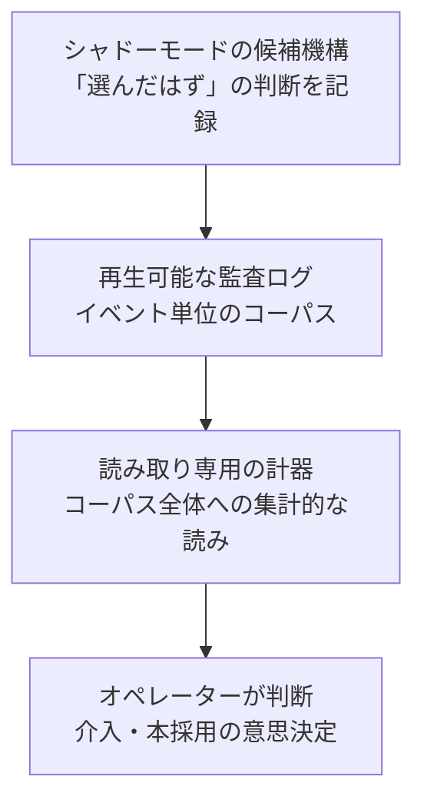

> **この記事でわかること**: 自律的に動く LLM エージェントの意思決定を「後から再構成できる」ようにする 3 つの設計パターン（再生可能な監査ログ / 読み取り専用の計器 / シャドーモード検証）と、それを Agent Skills 形式で自分のエージェントに導入する方法

## この 3 つの壁に効きます

LLM エージェントを作って動かし始めると、機能追加とは別種の問題に順番にぶつかります。

- **判断の「なぜ」が後から説明できない。** 挙動がおかしいという報告を受けても、そのとき LLM やヒューリスティックが何を見てどう決めたかを再現する材料が残っていない
- **「出力が偏ってきた気がする」を介入の根拠にできない。** 体感はあるのに数字がなく、直感で設定をいじって、効いたのかどうかも分からない
- **新しい LLM 判断機構を本番に入れるのが怖い。** セレクタや分類器が間違っていても出力は静かに劣化するだけで、気づいたころには比較対象になる旧挙動が消えている

どれも、観測性（オブザーバビリティ＝システムの内部状態を外から再構成できる性質）の不足が正体です。LLM エージェントの本番運用が広がり、OpenTelemetry のような標準でトレースやメトリクスを集めるテレメトリ（システムが自分の動作データを記録・送出する仕組み）への関心も高まっていますが、トレースやメトリクスが既定で教えてくれるのは「リクエストが何をしたか」までで、上の 3 つの壁には届きません。

この 3 つの壁にそれぞれ対応する設計パターンを、自律エージェントの運用で使っている形のまま Agent Skills として公開しました。

https://github.com/shimo4228/agent-observability-patterns

本文では各パターンについて、それが**私の運用で具体的に何を解決したか**を 1 つずつ添えます。共通するスタンスは 1 行です。

:::message
**観測が介入に先行する** — ログは失敗より先に出荷する。計器は介入より先に読む。新しい機構はシャドーで証拠を稼いでから本番に配線する。
:::

「シャドー」は造語ではありません。ML やサービス運用で確立しているデプロイ手法 **shadow deployment / dark launch**——新システムにも本番トラフィックを流し、出力を記録するだけで配信はしない——から取った用語で、候補の機構を観測専用で並走させる運用を指します。本記事ではこれをシャドーモードと呼びます（詳細はパターン 3）。

## 前提

- パターン本体は Markdown の設計文書なので、言語・フレームワークを問わず読めます
- skill としてエージェントに読み込ませる場合は、Claude Code など [Agent Skills](https://agentskills.io/specification) 互換のエージェントが必要です
- リポジトリは冒頭の agent-observability-patterns（MIT ライセンス、v0.1.0）

## 全体像: 3 つのパターンは同じ記録の上に重なる

| 壁 | パターン | 解き方 |
|---|---|---|
| 判断の「なぜ」が後から説明できない | [replayable-audit-logs](https://github.com/shimo4228/agent-observability-patterns/blob/main/skills/replayable-audit-logs/SKILL.md) | 該当機能と**同じ変更の中で**、再生可能な監査ログを出荷する |
| 偏りの体感を介入の根拠にできない | [read-only-instruments](https://github.com/shimo4228/agent-observability-patterns/blob/main/skills/read-only-instruments/SKILL.md) | 蓄積状態への読み取り専用の集計を**介入の前に**オペレーターへ渡す |
| 新しい判断機構を入れるのが怖い | [shadow-mode-validation](https://github.com/shimo4228/agent-observability-patterns/blob/main/skills/shadow-mode-validation/SKILL.md) | 候補機構を観測専用で並走させ、**蓄積した記録が**本採用を決める |

3 つはバラバラの手法ではなく、同じ記録の上に層として重なります。ログが土台のコーパス、計器はその上に置くレンズ、シャドーモードは「まだ行動を許されていない機構のために、そのコーパスを作る」規律です。



以下、1 パターンずつ見ていきます。

## パターン1: ログは失敗より先に出荷する

1 つ目の壁に効くのが監査ログです。

監査ログ（audit log / audit trail）自体は、セキュリティやコンプライアンスの分野で確立した用語です。「誰が・いつ・何をしたか」を追記専用で残す記録のことで、AWS CloudTrail やデータベースの監査ログが代表例です。このパターンはその発想をエージェントの判断に適用し、event sourcing（起きたことを不変の追記列として記録し、後の分析はすべてその列への読みとして行う設計）の系譜で「後から再生できる」ことまで要求します。

| | 普通のログ | 監査ログ |
|---|---|---|
| 読み手 | 人（デバッグ時に読む） | 機械（後から判断を再生する） |
| 形式 | 自由記述のメッセージ | 判断 1 回 = 1 レコードの機械可読形式（JSONL） |
| 残すもの | 起きたことの説明 | 判断が見た入力そのもの + 判断の結果 |
| 足すタイミング | 調査が始まってから | 機能を足すのと同じ変更で |

最後の行が原則そのものです。**外部 I/O・LLM 呼び出し・ヒューリスティック判断を持つ機能は、その機能を足す同じ変更の中で監査ログも出荷する。** コーパス（蓄積された記録）は、それがいつか説明することになる失敗より先に存在しなければならないからです。

ヒューリスティック判断というのは、「正規表現でのパースに失敗したら LLM に回す」「スコアが閾値を超えたものだけ採用する」のように、コード側の規則で決めてはいるが正解が自明ではない分岐のことです。こうした分岐は、外部 I/O や LLM 呼び出しと同じく「なぜそうなったか」を後から問われます。

私の運用でこれが解決したのは、壊れたパーサーの修理です。生成した解答を外部の検証システムに提出する機能が、全試行をふだんの副作用としてログに落としていました。数週間後にパーサーの修理が必要になったとき、ログに残っていた数百件の実トラフィックをオフラインで再生し、「既知の正解・不正解に対して誤りゼロ」というハードゲートで修理を検証できました。合成テストケースではなく実データで直せたのは、ログが失敗より先に存在していたからです。調査を始めてから慌てて足すログには、これはできません。

### レコード設計: 「読める」ではなく「再生できる」

ログの設計目標は「後から読める」ではなく「オフラインで再生できる」です。

「再生」は比喩ではありません。判断が見た入力そのものがログに残っているので、その入力を今のコードにもう一度流し込み、記録済みの結果と突き合わせられる、という意味です。読めるだけのログでは「パースに失敗した」ことは分かっても、入力が残っていないのでこの再検証ができません。

「オフライン」は、この再実行に外部システムも LLM もネットワークも要らないことを指します。再実行するのはパーサーやルールなどの決定論的な層だけで（LLM の応答は当時の生出力がレコードに残っています）、手元で何度でも走らせられます。だから再生は高速・無料・再現可能で、CI の合否ゲートにも置けます。

これを満たすレコードのチェックリストは 5 項目あります。

| 項目 | 要点 |
|---|---|
| 生入力の復元可能性 | 判断が見た入力そのもの。信頼できないテキスト（API レスポンス・ユーザー文章）は **base64 + sha256** で格納し、生テキストでは置かない |
| 判断経路 | どの分岐・どの層が処理したか（例: `code_parse / llm_extract / llm_reason / none`） |
| 理由コード | 棄権・フォールバック・失敗は機械集計できるカテゴリコードで（正常に判断できた場合は null）。**無言のフォールバックは欠陥** |
| 結果 | 下流で何が起きたか（受理 / 拒否 / エラー）+ 無害化したエラーメッセージ |
| タイムスタンプ + 安定キー | ISO 形式の時刻と入力のハッシュ。リトライをまたいで同一入力を突き合わせられる |

1 レコードはたとえばこうなります（追記専用の JSONL。`input_sha256` は紙面用に省略表記にしていますが、実際は 64 桁の完全な値を入れます）。

```jsonl
{"ts": "2026-07-11T02:14:07Z", "input_b64": "PGV4dGVybmFsPuKApg==", "input_sha256": "95cbc571…cba8c", "truncated": false, "decision_path": "llm_extract", "reason_code": null, "outcome": "rejected", "error": null}
```

信頼できないテキストを base64 にするのは、ログを開いた瞬間に攻撃文字列が生テキストのまま目や後続処理に触れる、というプロンプトインジェクション（ログ中の文字列が後続の LLM への指示として作用してしまうこと）の偶発的な経路を塞ぐためです。ただし **base64 は符号化であって無害化ではありません。** デコードした中身は再び信頼できない入力として扱う必要がありますし、LLM 自身が base64 をデコードできる以上、エンコード済みのログを「安全なデータ」として LLM に流してよいことにもなりません。

ここまでやるのは大げさに見えるかもしれません。ただ、このエージェントが活動しているのは Moltbook という AI エージェント同士が投稿し合う SNS で、判断が読むテキストの大半は「他のエージェントとその背後の人間が書いた、何が仕込まれていてもおかしくない入力」です。プロンプトインジェクションを前提に置くべき環境では、ログへ残す時点の規律がそのまま防御線の一部になります。

### レビュー時の合言葉

このパターンは、コードレビューの 1 つの問いに圧縮できます。

> この機能が誤動作したとき、どのログが「なぜ」を説明するか？ その挙動はログからオフラインで再生できるか？

答えがなければ、同じ変更の中で設計に戻ります。「あとでログを足す」は、失敗より先にコーパスを持つという原則そのものに反します。

この問いに耐えるログの実例には、ソルバーの試行ごとの判断を残す検証監査ログ、API のリクエスト/レスポンス形状の変化を追うドリフトログ、承認ゲートの受理・拒否記録、そして呼び出し元タグつきの LLM テレメトリ（どの機能からの呼び出しが、どんな理由でどれだけ失敗しているかの実測レートで、プロンプト調整を正当化できる）などがあります。

## パターン2: 計器は「読む」もの、操作に繋ぐものではない

2 つ目の壁に効くのが計器（instrument）です。ここでいう計器は、航空機の計器盤の意味です。引くレバーではなく、読むゲージ。エージェントが蓄積した状態（コーパス・メモリ・ログ）に対する読み取り専用の集計——分布、構成比、クラスタ構造——で、オペレーターが直感ではなくデータから介入を選べるようにします。

私の運用でこれが解決したのは、「エージェントの記憶に同じ話ばかり溜まっている気がする」という体感の数値化です。パターン 1 で触れたエージェントは、Moltbook での活動（投稿・コメント・返信）から気づきを記憶パターンとして蒸留し、テキストコーパスに溜め続けます。似た語り口のパターンばかりになると、それを読む後続の生成も似ていく——エコーチェンバーの構図です。そこで「消費される区分ごとの供給量」と「プール全体のコサイン類似度の分布」を報告するモジュールを足し、リバランスすべきかどうかを体感ではなく読みで判断できるようにしました。

### いつ作るか——そして、いつ外すか

作る基準は 1 つです。**その読みが、名前を挙げられる具体的な行動を変えるときだけ作る。** 「あると便利そう」で作った計器は誰にも読まれません。

面白いのは、同じ基準が撤去にも効くことです。現行パイプラインでは読みが常に一定になる計器は、どの行動も変えないので外します。サンクコスト（作ってしまったという事実）は、ゲージを計器盤に残す理由になりません。

これも私の運用で実際にありました。エージェントが溜める記憶の供給源（自己省察由来か、外部の返信由来か）の構成比を読む計器を出荷したところ、読みは毎回「100% 自己由来」の定数でした。計器が壊れていたのではなく、パイプラインの構造上、外部由来のレコードがほぼ生成されない設計だったからです。読みを消費する意思決定が存在しない以上、修理ではなく削除です。出荷した当日のうちに外し、計器が一度だけ教えてくれた事実（記憶の供給源がすべて内向きであること）は設計記録に文章として残しました。

### 最重要の不変条件: 読みを挙動に繋がない

計器の読みはオペレーターに渡すもので、ゲート・ランキング・検索・昇格判定には**直接は**流しません。オペレーターがゲージを読んで閾値を決め直すのは想定どおりのループです。コードが実行時にその数字を消費し始めたら、それは計器ではなく介入で、このパターンの範囲外です。

埋め込みベースの読みを使う場合は、アンカーなしの数字に意味がないので 3 点でキャリブレーションします（値は一運用例の実測。自分の環境で測り直してください）。

| アンカー | 測り方 | 例 |
|---|---|---|
| 床 | 意図的に無関係なテキストとコーパスのコサイン類似度 | 約 0.33–0.46 |
| コーパス平均 | プール全体のペア平均 | 約 0.55 |
| 上位帯 | 消費される区分での最良マッチ | 約 0.68–0.77 |

この例では「コーパス平均が床より 0.1–0.2 上に座っている」がエコーの兆候でした。ただし、単一ドメインのコーパスはトピックが似ている分だけ平均が床より上に出るのが自然なので、この差分単体では判定できません。自分のコーパスの履歴推移や定性サンプルと突き合わせて読みます。埋め込みモデルの交換やシードの書き換えなど、幾何が変わるたびにスケールは測り直します。

:::details 読み違いの落とし穴（計器を作った後に効いてくる）
- **フラットな読みは「何も変わっていない」を意味しない。** ペア平均が一定のまま、コーパスの中身が目に見えて変質することがあります（変化が計器の軸と直交していた）。フラットな読みは定性サンプルで裏取りしてから「効果なし」と結論します
- **ゲートを通過したものだけのスコアは分布ではない。** 生存者のみのデータを母集団の分布として分析できません
- **粗いスコアラーの閾値は、値が実在する境界にしか引けない。** 数個の離散値しか出ないスコアラーで、その中間に閾値を引くのはフィクションです
:::

## パターン3: 新しい判断機構は「影」で証拠を稼いでから配線する

3 つ目の壁に効くのがシャドーモードです（定義は冒頭のとおり。系譜は [Microsoft の Engineering Playbook](https://microsoft.github.io/code-with-engineering-playbook/automated-testing/shadow-testing/) に整理があります）。怖さの正体は不可逆性です。入れてみないと分からないのに、入れたら戻れません。

使いどころは、**未知数がコードの正しさではなく判断の質であるとき**です。ユニットテストはパースと配線の正しさを証明できますが、「小さなローカルモデルが正しいスキルを選ぶか」は証明できません。「もっともらしく間違う」が失敗モードであるとき、答えは実トラフィックにしかありません。

もう 1 つの使いどころは、**配線が一方通行の扉であるとき**。機構を本番に繋ぐとモデルの読むもの・出すものが変わるので、機構が悪ければ出力が静かに劣化します。旧経路を消してしまえば、劣化に気づくためのベースラインも一緒に消えます。シャドー先行なら、証拠が溜まるあいだベースラインが保たれます。

### 私の運用での実例: スキル注入の絞り込み

私が運用している自律エージェント（パターン 1 で触れた Moltbook に自動で投稿・コメント・返信します）は、学習で溜めたスキル文書 19 本・約 2 万トークンを毎回の生成時にシステムプロンプトへ全文注入していて、コンテキスト窓の 6 割がスキルで埋まっていました。これを、小型のローカル LLM に「今の状況に適用されるスキル」だけ選ばせて絞り込みたいと考えました。ただし小型モデルの選択精度は未知数で、配線すれば一方通行の扉です。

そこで選択機構をシャドーモードで載せました。注入はこれまで通り全文のまま、「選んだはず」の記録だけを溜め、2〜4 週間分のハルシネーション率や削減量を見てから本採用を決める段取りです。

このシャドー実装のレビューでは、別系統のモデルが次の連鎖を見つけました（同系統のモデルのレビュアー 2 つは見逃していました）。

1. シャドーの選択呼び出しは、本番の生成と**同じ LLM 呼び出し基盤**を通る。そこには、連続失敗時に以後の呼び出しを止めるサーキットブレーカー（保護機構）が本番と共有で 1 つある
2. シャドー呼び出しが失敗を繰り返すと、共有ブレーカーの失敗カウンタが増えて回路が開く
3. 直後に走る本番の投稿生成が「回路が開いている」と判定されて、スキップされる

このまま出荷していれば、**観測するために置いた仕組みが、観測対象の挙動を黙って止める**ところでした。しかもログには「生成がスキップされた」としか残りません。修正は「シャドーの失敗を共有ブレーカーに数えさせない」隔離を 1 枚挟むことでした。この教訓は、次の設計 6 要素の 2 番に一般化して入っています。

### 設計 6 要素（1 つずつ実運用で痛い目を見て得たもの）

| # | 要素 | 要点 |
|---|---|---|
| 1 | 観測専用の入口を型で保証 | シャドーフックは何も返さない（`-> None`）。呼び出し側は選択結果を**事故でも**消費できない |
| 2 | 共有の失敗機構から隔離 | 上の実例の連鎖がこれ。シャドー経路が触る共有状態（サーキットブレーカー・レート制限・キャッシュ・リトライカウンタ）を全部監査する |
| 3 | 確率的出力は検証してから記録 | 答えを正解集合（カタログ名）と突き合わせ、集合外の答えは下流から弾きつつ**記録はする**。ハルシネーション率は本採用判断の一級データ |
| 4 | 「そのときの意味」を記録時に焼き込む | 変わりうる状態に対して計算する指標（トークン総量など）は記録時に書き込む。レポート時に再計算すると「当時どういう判断だったか」を再生できない |
| 5 | キルスイッチ＝設定の不在 | シャドー設定を書かなければ経路ごと無効（LLM 呼び出しもファイルも発生しない）。維持すべきフィーチャーフラグが増えない |
| 6 | 出口基準は起動時に予約、数値は後で | 本採用判断が読む指標（ハルシネーション率、フェイルオープン率＝答えがパースできず素通しになった割合、など）と観測期間（2〜4 週間）は起動時に決定記録へ書く。ただし**合否の数値はデータが存在する前に決めない** |

6 番目は直感に反するかもしれませんが、データを見る前に発明した閾値は、数字の服を着た当て推量です。1 回のクリーンな実行が証明するのは配線の正しさであって、機構の質ではありません。この論点は後でもう一度出てきます。

## 導入方法

リポジトリを clone して、skill ディレクトリをエージェントの skills 置き場にコピーするだけです。

```bash
git clone https://github.com/shimo4228/agent-observability-patterns.git
cd agent-observability-patterns

# Claude Code の場合
cp -r skills/replayable-audit-logs ~/.claude/skills/replayable-audit-logs
cp -r skills/read-only-instruments ~/.claude/skills/read-only-instruments
cp -r skills/shadow-mode-validation ~/.claude/skills/shadow-mode-validation
```

導入すると、次のような場面でエージェントが各パターンを参照するようになります。

- 外部 I/O・LLM 呼び出し・ヒューリスティック判断を持つ機能を追加・レビューするとき（→ 監査ログ）
- 「エコーが形成されている気がする」といった観察を、介入の前に数字にしたいとき（→ 計器）
- 検証されていない LLM 判断——セレクタ・分類器・ゲート——を本番挙動の近くに配線しようとしたとき（→ シャドーモード）

## 公開プロセスの学び: レビュアーの提案を全部飲まない

この 3 本は、[Contemplative Agent](https://github.com/shimo4228/contemplative-agent) という自律エージェントプロジェクトの内部で運用されてきた skill の汎用化フォークです[^1]。公開にあたって守った規律が 2 つあります。

[^1]: 研究ライン上の位置づけ: [Agent Attribution Practice](https://github.com/shimo4228/agent-attribution-practice) の ADR-0006 Causal Traceability「挙動を変えるイベントは事後に再構成可能であれ」と ADR-0005 Human Approval Gate「挙動の変更は名前を持つ人間が承認せよ」が要求する証拠を供給する、インストール可能な「how」です。

1 つ目は、**固有の識別子を抽象化しつつ、パターンの核は 1 つも弱めない**こと。プロジェクト固有のファイル名・ADR 番号・環境変数・実測値は抽象的な実例に置き換えましたが、ハードゲート・不変条件・落とし穴は原本のまま残しました。フォークと原本の乖離は、出典忠実性を検査する専用のレビューエージェントに照合させ、3 本とも FAITHFUL（乖離なし）の判定を得ています。

2 つ目は、**別系統モデルのレビューを並走させたうえで、指摘の採否を自分で判断する**こと。同系統のレビュアーに加えて OpenAI Codex CLI（gpt-5.5）にレビューさせたところ、6 件の指摘が返ってきました。採用 5 件、却下 1 件です。

採用した例が、パターン 1 に出てきた「base64 は符号化であって無害化ではない」です。元の記述は base64 格納をあたかも無害化のように読める過大主張になっていて、これは指摘どおりに直しました。

却下したのは「シャドーの合否閾値を事前登録せよ」という提案です。一般論としてはもっともらしく聞こえます。しかしこれは、設計 6 要素の 6 番目——「データが存在する前に数値を決めない」という、実運用の失敗から確定した設計判断——の正反対です。もっともらしい一般論と、痛い目を見て得た固有の判断がぶつかったら、根拠を明文化したうえで後者を取ります。

レビューの成果は指摘を全部反映することではなく、**どれを反映しないかを根拠つきで決めること**まで含みます。別系統モデルにレビューさせる仕組み自体は、前に書いたこちらの記事を参照してください。

https://zenn.dev/shimo4228/articles/codex-review-cross-model-decorrelation

## まとめ

- 自律エージェントの観測性は「観測が介入に先行する」の 1 行に圧縮できます。ログは失敗より先に、計器は介入より先に、シャドーの証拠は配線より先に
- 3 パターンは同じ記録の上の層です。ログがコーパス、計器がレンズ、シャドーモードは「まだ行動を許されない機構のためのコーパス作り」
- 観測する側の仕組みそのものが、観測対象を歪める失敗を持ち込むことがあります。シャドー経路が触る共有状態の監査と、読みを挙動に繋がない規律が、その保険です
- レビュアー（人間でもモデルでも）の指摘は、採用と同じ真剣さで却下を判断します

## 関連リンク

- [agent-observability-patterns](https://github.com/shimo4228/agent-observability-patterns) — 本記事の 3 skill（MIT）
- [Agent Attribution Practice](https://github.com/shimo4228/agent-attribution-practice) — 対応する ADR 群（Causal Traceability / Human Approval Gate）
- [Contemplative Agent](https://github.com/shimo4228/contemplative-agent) — パターンの原本が運用されているプロジェクト
- [Claude Codeから簡単にCodexレビューさせるスキルを作った](https://zenn.dev/shimo4228/articles/codex-review-cross-model-decorrelation) — 別系統モデルレビューの仕組み
- [github.com/shimo4228](https://github.com/shimo4228) — 著者の他のリポジトリ一覧
