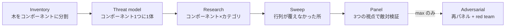

> **この記事でわかること**: Anthropic 公式のセキュリティスキャンプラグイン `claude-security`（ベータ）を実際に回した実測です。何をするツールで、どれだけ時間がかかり、どんな出力を返し、どこまで信用できるかを、成果物の実データつきで説明します。

公式プラグインが出たことは知っていても、次のあたりで手が止まると思います。

- **コストが読めない。** 起動時に「かなり時間とトークンを使う」と警告されるが、具体的にどれくらいなのか書いていない
- **出力の質が分からない。** 既存の静的解析ツールと何が違うのか、LLM が読むだけで本当に使える指摘が出るのか
- **回した後どうするのか分からない。** 何十件も返ってきたとして、どこから手を付けるのか

筆者は 2026-07-25 に v0.10.0 を導入し、自分の `~/.claude` 設定一式（hooks・skills・agents・権限設定）を丸ごとスキャンしました。**189 個のサブエージェントが 2 時間動いて 20 件**を返しました。この記事はその実測レポートです。

:::message
このプラグインは 2026-07 時点でベータです（バージョンも 0.10.0）。以下の数値・挙動はすべて v0.10.0 の実測で、今後変わる可能性があります。
:::

## 前提: 必要なもの

| 項目 | 条件 |
|---|---|
| Claude Code | 実測は 2.1.220 |
| プラグイン | `claude-security` v0.10.0（Anthropic 製、marketplace は `claude-plugins-official`） |
| Python | python3 3.9 以上（レポート生成スクリプトが使います） |
| git | 差分スキャンは git checkout が前提。リポジトリ全体スキャンは git なしでも動作します |
| 権限モード | auto mode 推奨（プラグイン自身がそう案内します） |

このプラグインはホスト版 [Claude Security](https://claude.com/product/claude-security) の「セッション内で完結する版」です。別プロセスもデーモンも立てず、あなたの Claude Code セッションの中だけで動きます。

## どういうツールで、回すと何が起きるか

### インストールから起動まで

```bash
# Claude Code のセッション内で実行します
/plugin install claude-security@claude-plugins-official
/reload-plugins
```

marketplace が見つからないというエラーが出たら、先に `/plugin marketplace add anthropics/claude-plugins-official` を実行してから再試行します。

導入後、`/claude-security` でメニューが開きます。3 つのジョブから選ぶ形です。

| ジョブ | 対象 | 所要 |
|---|---|---|
| **Scan codebase** | リポジトリ全体、またはディレクトリを絞った一部 | 規模による（筆者の実測で 2 時間 1 分） |
| **Scan changes** | ブランチの差分、プルリクエストの差分、単一コミット | 小さい差分なら数分 |
| **Suggest patches** | 既存レポートの findings を修正パッチファイルに変換 | findings 数による |

メニューを経由せず、引数で直接指定することもできます。

```text
/claude-security scan my branch's changes
/claude-security --base main
/claude-security 3cb30d2          # 7 文字以上の 16 進数はコミット SHA として解釈されます
```

### 確認プロンプトを先に済ませる

全体スキャンを選ぶと、必ず次の確認が入ります。

> This scan may take a while and may use a significant number of tokens. You will need to leave Claude Code open while the scan completes. Are you sure you want to continue?

ここで承諾を先に渡しておくと、確認を挟まず直行できます。判定は文字列の厳密一致ではなく「時間とトークンのコストを受け入れる意思が読み取れるか」という意味で行われるので、その趣旨が伝わる一文を添えます。

```text
/claude-security scan this repository — whole codebase.
I understand it may take a while and use a significant number of tokens.
```

:::message
スキャン中は Claude Code を開いたままにする必要があります。操作は不要なので、席を外して構いません。
:::

### effort が変えるのは「探す量」であって「検証の厳しさ」ではない

`--effort` は 4 段階です。ここが設計として特徴的な点で、**どれを選んでも検証パネルは 3 票で固定**されています。

| effort | 何をするか |
|---|---|
| `low` | リポジトリ全体に researcher を 1 体。inventory・脅威モデル・網羅スイープなし |
| `medium`（既定） | 全工程。inventory → 脅威モデル → コンポーネント × カテゴリごとに researcher 1 体 → スイープ 1 回 → 3 票パネル |
| `high` | `medium` に加えてコンポーネント上限を 24 に拡大、researcher を各セル 2 体、スイープ 2 回 |
| `max` | `high` に加えて敵対フェーズ。判定が際どかったものを再パネルにかけ、生き残り全件に red team を当てる |

つまり effort を下げても「雑に通す」のではなく「探す範囲が狭くなる」だけです。ドキュメントもそう明言していて、レポートの信頼度の数字はこの 3 票を基準に較正されている、と書かれています。筆者は `medium` で回しました。

### 6 段階のパイプラインが走る



`~/.claude` に対する実測がこうなりました。

| 段階 | エージェント数 | 内訳 |
|---|---|---|
| Inventory | 1 | 木を 11 コンポーネントに分割 |
| Threat model | 11 | コンポーネント 1 つに 1 体 |
| Research + Sweep | 42 | コンポーネント × カテゴリの各セルに 1 体。スイープ分もこの枠に含まれます |
| Panel | 135 | 45 候補 × 3 票 |
| **合計** | **189** | **2 時間 1 分** |

この内訳と所要時間は見積もりではなく実測です。自分の実行結果でも同じ集計ができます。ワークフローの `journal.jsonl` に各エージェントの戻り値が記録されているので、戻り値の形で分類できます。

```bash
# ~/.claude/projects/<プロジェクト>/<セッションID>/subagents/workflows/wf_*/ で実行します
python3 - <<'PY'
import json, collections
sig = collections.Counter()
with open("journal.jsonl", encoding="utf-8", errors="replace") as f:
    for line in f:
        try: d = json.loads(line)
        except ValueError: continue
        if d.get("type") != "result": continue
        r = d.get("result")
        sig[tuple(sorted(r))[:5] if isinstance(r, dict) else ("?",)] += 1
for k, v in sig.most_common(): print(v, k)
PY
```

```
135 ('reasoning', 'verdict')                                          ← パネル投票
 42 ('findings',)                                                     ← researcher
 11 ('assumptions', 'entryPoints', 'hotFiles', 'sinks', 'trustBoundaries')  ← 脅威モデル
  1 ('components', 'securityScanSkippedComponents')                    ← inventory
```

所要時間も同じログから出ます。最初の記録が `02:28:12Z`、最後が `04:29:16Z` でした。途中の最大の空白は 47 秒しかなく、2 時間ずっと何かが動いています。

ただし**これは「2 時間拘束される」という意味ではありません**。Claude Code のウィンドウを開いたままにしておく必要はありますが、操作は不要です。プラグインの内部ドキュメントにも、それを前提にした一文があります。

> Users desire to leave the session unattended very soon after kicking off a scan, around a minute of wall-clock time.
> （ユーザーはスキャンを開始してからごく短時間、実時間で 1 分ほどで、セッションを放置して離れたがるものである）

実際そのとおりで、筆者はこの間、別のセッションを開いて無関係な作業を進めていました。

進行中の様子は `/workflows` で各段階の進捗として見えます。

## 出力はどうだったか

終わると、タイムスタンプ付きのディレクトリに 3 種類の成果物が出ます。

```
CLAUDE-SECURITY-20260725-022756/
├── CLAUDE-SECURITY-RESULTS.md        # 人が読むレポート
├── CLAUDE-SECURITY-RESULTS.jsonl     # 機械可読（1 finding 1 行）
└── CLAUDE-SECURITY-REVISION-*.json   # 実行時のリビジョン・設定の刻印
```

結果は **20 件（HIGH 5 / MEDIUM 15）**。生の候補 111 件が重複排除で 83 件になり、パネルにかかった 45 件のうち 25 件が却下されて残ったのがこの 20 件です。

却下率が半分以上あるという数字は、パネルが機能している証拠とも、researcher 側が候補を過剰に出していてパネルが後始末をしている証拠とも読めます。どちらなのかを判定する材料は、レポートには含まれていませんでした。

判定材料になるのは出口側の数字です。**筆者は届いた 20 件すべてに対応し、誤検知として却下したものはゼロでした。**各指摘について実際に再現を確認してから修正しています（ただし 3 件は部分対応で、OS レベルの隔離までは入れていません）。あくまで 1 リポジトリの 1 回分ですが、少なくともこのケースでは「読んで判断するだけのツールが的外れな指摘を並べる」ということは起きませんでした。

以下、出力の質について実際に効いた点を 3 つ挙げます。

### 1. 設定ファイルと自然言語の指示ファイルまで読む

inventory の分割結果がこうでした。

```
hooks / scripts / scheduled-tasks / skills-executable-scripts /
skills-instructions / agents / rules / templates / docs /
notes-and-metrics / tests
```

`rules` と `skills-instructions`、つまり**自然言語で書いた指示ファイルが、独立した監査対象コンポーネントとして扱われています**。

実際、返ってきた 20 件の内訳はこうなりました。

```
hooks: 10 / skills: 5 / settings.json: 3 / scheduled-tasks: 1 / agents: 1
```

`agents` の 1 件は、agent 定義の `.md` に書いた**信頼順位の指示そのもの**への指摘でした。ある agent は「セッションの生ログは機械的な記録だから改竄しにくい」として、それを最上位の信頼ソースに置いていました。

しかしそのログには、過去に取得した外部ページの本文がそのまま入ります。ファイルとしては改竄しにくくても、中身は信頼できません。

`scheduled-tasks` の 1 件も似た性質で、README が「未配線」と書いていたジョブが、実際には登録済みで毎週稼働していました。**ドキュメントと実態の食い違いを、リスク評価を誤らせる要因として指摘**してきます。

正規表現でパターンを探すツールでは、この 2 件はどちらも出ません。

### 2. 件数を水増しせず、自分で畳んで見せる

レポートの冒頭がこう書いています。

> Read the count with one caveat: the 20 are not 20 distinct defects.
> （件数は但し書きつきで読んでほしい。この 20 件は 20 個の別々の欠陥ではない）

そして 3 つのクラスタを自分で名指しします。

| クラスタ | 件数 | 実体 |
|---|---|---|
| **権限設定の許可リスト** | 3 | `settings.json` の同じ 1 行を、3 つの視点から見たもの |
| **ログ保護ガードの綻び** | 8 | 同じ資産を守る 3 つの hook が、共有している定数 1 個のせいで揃って素通りしていた |
| **子エージェントの実行権限** | 4 | ある skill が子の Claude を起動するときに、生成された文字列をそのまま実行していた 2 経路 |

この 3 クラスタで 15 件を占め、残り 5 件が単発でした。レポートは全体を「根本原因で数えれば 8 個程度」と表現しています。

さらに踏み込んで、**8 件のクラスタについては「単独で最もレバレッジの高い修復はこれ」と 1 箇所を名指し**していました。そこを直せば 7 件が同時に閉じる、という書き方です。検出件数が性能指標として扱われやすい分野で、自分から件数を畳んで見せる作りになっています。

### 3. 機械可読側で自分の関心順に並べ替えられる

レポート本文は長いので、まず jsonl で全体像を掴みます。

```bash
# CLAUDE-SECURITY-<timestamp>/ の親ディレクトリで実行します
python3 - <<'PY'
import json, collections, glob
path = glob.glob("CLAUDE-SECURITY-*/CLAUDE-SECURITY-RESULTS.jsonl")[0]
with open(path) as f:
    rows = [json.loads(line) for line in f]
print("件数:", len(rows), collections.Counter(r["severity"] for r in rows))
print("配置:", collections.Counter(r["file"].split("/")[0] for r in rows))
PY
```

```
件数: 20 Counter({'MEDIUM': 15, 'HIGH': 5})
配置: Counter({'hooks': 10, 'skills': 5, 'settings.json': 3, 'scheduled-tasks': 1, 'agents': 1})
```

1 行は `id` `title` `severity` `confidence` `file` `line` `exploit_scenario` `preconditions` `recommendation` `cwe_id` などのフィールドを持ちます。

`severity` だけでなく `confidence` も見る価値があります。この値はパネルの票数で決まるからです。

> Confidence in this report is clamped by that vote — only unanimous panels claim `high`.
> （このレポートの信頼度はその投票で頭打ちになる。`high` を名乗れるのは全会一致のパネルだけである）

## どこまで信用できるか

**このツールは限界を自分から開示します。**静的解析のレポートでは省略されがちな 3 点が、本文に明記されていました。

### レポートが自分から書いている限界

1. **未レビューの候補がある** — 筆者のケースでは 38 候補サイトが、重複排除と上限適用の後でパネルに回りませんでした。先ほどの「45 候補 × 3 票」はパネルに回った分だけの数字で、この 38 はそこに含まれていません。原文が「このレポートに無いことは、木に無いことの証明にはならない」と明記しています
2. **除外領域を名指しする** — 筆者のケースでは vendored な Python 仮想環境 3 件と `__pycache__`。しかも「その仮想環境の依存パッケージ自体が汚染されていたら、このスキャンは見ていない」と注記が付きます
3. **カバレッジを会計する** — トップレベルのディレクトリは「スキャンした」か「理由つきで除外した」のどちらかでなければならず、その照合は探索開始**前**に行われます。筆者のケースでは 11 ディレクトリすべてが accounted for でした

### コードを一切実行しません

テスト実行なし、exploit 発火なし、PoC 検証なし。すべて読解のみで導出されています。筆者のケースで最も重い指摘だった任意コード実行の経路も、実際に攻撃ファイルを置いて確かめたのではなく、**隣にある似た hook と読み比べて**確認されていました（そちらには既に同じ防御が入っていた、という発見の仕方です）。

これは安全側の設計ですが、裏を返すと**再現性のある確認は自分の責任**になります。筆者は各修正を、先に失敗するテストを書いてから実装する形で進めました。

### 非決定的であることを公式が認めています

README にこう書かれています。

> Scans are nondeterministic. Two scans of the same code can surface different findings.
> （スキャンは非決定的である。同じコードを 2 回スキャンしても、違う findings が出ることがある）

そして「人間のセキュリティ研究者がコードについて考えるのと同じやり方で推論するので、SAST・依存関係スキャン・コードレビューを**置き換えるのではなく補完する**」と続きます。静的解析の代わりに置くツールではありません。

### 何も書き換えません

スキャンは読むだけです。パッチ生成ジョブを使っても、作業ツリーは触られず、コミットもプッシュもプルリクエストも作られません。パッチファイルがディスクに置かれて終わりで、当てるかどうかは自分で決めます。

## 回した後どうするか

### 優先順位のつけ方

筆者は次の 4 段階で判断しました。

| 優先度 | 条件 | 理由 |
|---|---|---|
| 1 | **単独で任意コード実行が成立する** | 他の防御を全部素通りするので、これを残したまま他を直しても意味がありません |
| 2 | **1 個の定数・アンカーに帰着するクラスタ** | 1 箇所直すと複数件が同時に閉じます |
| 3 | **信頼の向きが逆になっている定義** | コードは正しくても、判断の前提が壊れています |
| 4 | **ドキュメントと実態の食い違い** | 実害は間接的ですが、レビュアーに誤った安心を与えます |

優先度 2 はレポート側が名指ししてくれるので、**まず本文に「最もレバレッジが高い」という趣旨の記述がないか探す**のが早道です。

### 推奨をそのまま採らなくていい

`recommendation` フィールドは的確ですが、唯一解ではありません。1 つ例を挙げます。

筆者の `settings.json` には `Bash(bash:*)` `Bash(python:*)` のような、インタプリタ全体を許可するエントリが並んでいました。これがあると他の約 80 個の細かい許可設定がすべて無意味になります。`bash -c '<なんでも>'` が前方一致で通ってしまうからです。

レポートの推奨は「これらを `permissions.deny` に入れよ」でした。採らずに、**許可リストからの除去**を選びました。

- **deny は「拒否」なので、正当な実行まで恒久的に不可能にします**
- **許可リストから外すと auto mode では確認プロンプトになるだけなので、判断を人間に戻せます**

置き換えの形は「インタプリタ名で許可する」から「走らせるスクリプトで許可する」への変更です。

```diff:settings.json
-      "Bash(python:*)",
-      "Bash(python3:*)",
-      "Bash(sh:*)",
-      "Bash(bash:*)",
-      "Bash(node:*)",
-      (ほか export / source / command も除去 — 計 8 件)
+      "Bash(bash ~/.claude/hooks/:*)",
+      "Bash(bash ~/.claude/scripts/:*)",
+      "Bash(bash ~/.claude/tests/:*)",
+      "Bash(python3 ~/.claude/skills/:*)",
+      "Bash(python3 -m pytest:*)",
+      "Bash(python3 -m scripts.:*)",
```

**指摘は正しく、推奨は選択肢の 1 つ**、という距離感で使うのがよさそうです。

### 日常運用は Scan changes に乗せる

全体スキャンを毎回回すのは現実的ではありません。日常的に使うなら **Scan changes** です。

- ブランチの差分、プルリクエストの差分、単一コミットを対象にできます
- `medium` で「5 ファイル・300 変更行以下」の差分なら、コンポーネント行列を組まず researcher 1 体の軽い形で走ります（パネルの検証は変わりません）
- **コミット済みの変更だけが対象**です。作業ツリーの未コミット分は差分に入らないので、先にコミットするかスタッシュします

パッチ生成ジョブを使いたい場合は、**作業ツリーが汚れていない状態でスキャンする**必要があります。レポートの刻印に `revision.dirty: true` が入っていると、パッチ作成の前に停止します。筆者はまさに汚れた状態で回したので、この経路は使えませんでした。

:::details スキャナ自身がガードレールを踏んだ話
筆者の環境には、auto mode の確認スキップを悪用する動きを検知する自作の仕組みがあります。スキャン中、パネル投票者の 1 体が Claude Code のバイナリを permission-bypass 関連のシンボルで系統的に検索し、これを発火させました。

その候補はパネルで 0 対 3 で却下されましたが、レポートはこの挙動を埋めずに記載しています。原文の言い方が正確でした——「スキャナが自分のガードレールを探っているというのは、まさに読者に伝えるべきことだから」。
:::

## まとめ

ベータ版の実測として、持ち帰りどころをまとめます。

- **コストの目安** — 設定ディレクトリ 1 つ（11 コンポーネント規模）で `medium` なら 189 サブエージェント / 2 時間。日常運用は Scan changes 側に乗せる
- **出力の性格** — 正規表現では出ない指摘が出ます。設定ファイルと自然言語の指示ファイルまで監査対象に入り、ドキュメントと実態の食い違いも指摘されます
- **精度の実感** — 届いた 20 件のうち、誤検知として却下したものはゼロでした。1 リポジトリの 1 回分にすぎませんが、拾い読みして捨てる前提のツールではありませんでした
- **件数の読み方** — 件数を水増しせず、自分でクラスタに畳んで「最もレバレッジの高い修復」を名指しします。まずそこを探す
- **信用の範囲** — 未レビュー候補数・除外領域・コード非実行・非決定性を、すべてレポート自身が開示します。静的解析の代替ではなく補完

正直に書いておくと、筆者は**修正後の再スキャンをまだ実施していません**。指摘に対処したことを、このツール自身に再確認させていない状態です。非決定的である以上、同じ結果が返る保証もありません。そこも含めて、当面は「人間のレビュアーをもう 1 人増やした」くらいの位置づけで使うのが妥当だと感じています。

## 関連リンク

- [anthropics/claude-plugins-official](https://github.com/anthropics/claude-plugins-official) — `claude-security` プラグインの配布元
- [Claude Security](https://claude.com/product/claude-security) — 同機能のホスト版（この記事で扱ったのはセッション内で完結するプラグイン版）
- [github.com/shimo4228](https://github.com/shimo4228) — 筆者のリポジトリ一覧
