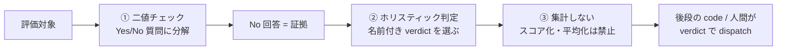
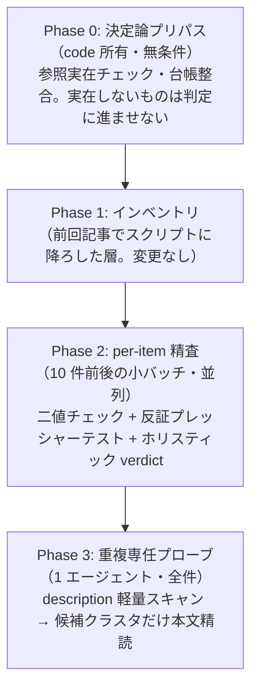

> **この記事でわかること**: LLM に品質評価をさせるとき、数値スコアの代わりに「二値チェック + 名前付き判定」で設計する方法。評価対象を差し替えればすぐ使える judge プロンプト構造つき。

LLM に成果物の評価をさせる手法は LLM-as-judge と呼ばれます。導入すると、多くの人が同じ壁に当たります。

- ルーブリック（採点基準表）で 5 点満点の採点をさせると、同じ入力なのに実行ごとに 3 点と 4 点を行き来する
- 合計スコアの閾値で合否を切ると、致命的な欠陥が 1 つあっても他の項目の高得点に薄められて通過する
- 後からスコアを読み返しても、「なぜ 3.5 点なのか」を誰も説明できない

この記事では、この 3 つの壁をまとめて回避する設計パターンを紹介します。核は 1 行です。

**チェックは Yes/No の二値で証拠を集め、判定は名前付き verdict のホリスティック判断で出させ、スコア集計はしない。**

私はこのパターンを Claude Code のスキル品質監査（`/skill-stocktake`）と知識抽出の品質ゲート（`/learn-eval`）で約 4 ヶ月半運用してきました。スキル監査のコマンドをどう作ったか——数値ルーブリックを捨てるに至った試行錯誤——は[前回の記事](https://zenn.dev/shimo4228/articles/skill-stocktake-design-journey)に書きました。

本記事はその続編です。あの設計を **LLM-as-judge の汎用パターンとして一般化**し、運用中に自分の設計を自分で検証して作り直したエピソードまで含めて紹介します。

## 前提

- 対象読者: LLM で成果物（文書・コード・データ）の品質評価を自動化したい人
- 例は Claude Code のスキル評価ですが、パターン自体は評価対象・モデル・ツールを問わず使えます
- 用語: **verdict**（バーディクト）= 評価の最終判定。この記事では「Keep / Retire のような名前付きの判定ラベル」を指します

## パターンの全体像 — 3 つの原則



| 原則 | やること | やらないこと |
|---|---|---|
| ① チェックは二値 | 評価項目を Yes/No で答えられる質問に分解する | 「具体性を 5 段階で採点」 |
| ② 判定は名前付き verdict | 全体を見て `Keep / Improve / Retire` 等から 1 つ選ばせる | 「合計 12 点なので合格」 |
| ③ 集計禁止 | No 回答を verdict の**根拠として列挙**させる | Yes の割合（充足率）を品質指標にする |

### ① チェックは Yes/No の二値にする

「このスキルの具体性は 5 点満点で何点か」ではなく、「読んですぐ実行できる具体的なコマンド例があるか？ Yes/No」と聞きます。

二値質問には、数値採点にない 2 つの性質があります。

- **検証できる**: 「コマンド例があるか」は本文を見れば白黒つきます。「具体性 3 点」は検証しようがありません
- **証拠になる**: No の回答は「何が欠けているか」をそのまま指します。改善リストに直結します

実運用しているスキル監査では、各対象にこの 4 問を必ず通します。

```markdown
- [ ] Actionability: すぐ実行できる手順・コマンド・実例があるか？
- [ ] Scope fit: 名前・トリガー・本文が一致しているか（広すぎ/狭すぎないか）？
- [ ] Uniqueness: 同じバッチ内の他スキルと内容が重複していないか？
- [ ] Currency: 参照しているパス・CLI フラグ・URL は現在も実在するか？
```

### ② 判定は名前付き verdict をホリスティックに選ばせる

ホリスティック判断（＝項目ごとの点数を経由せず、全体を見て 1 つの結論を出すこと）は LLM の得意分野です。前回記事で書いたとおり、LLM は次元ごとの独立採点が苦手で、全体の印象に引きずられます。それなら最初から「全体の印象で 1 つ選べ」と設計する方が素直です。

ポイントは verdict を**次のアクションと 1:1 対応する名前**にすることです。

| 運用例 | verdict の選択肢 | 対応するアクション |
|---|---|---|
| スキル監査 | `Keep / Improve / Update / Retire / Merge into [X]` | 維持 / 改善エンジンへ引き渡し / 技術更新 / 削除 / 統合（統合先を明示） |
| 知識抽出ゲート | `Save / Improve then Save / Absorb into [X] / Drop` | 保存 / 修正後保存 / 既存スキルへ追記 / 破棄 |

`accept / reject` の 2 値より、後段の処理がそのまま分岐（dispatch）できる enum（固定の選択肢の型）にする方が実用的です。`Merge into [X]` のように**対象の名前を強制する**設計にすると、「どこかと重複している気がする」という曖昧な判定が構造的に書けなくなります。

この「LLM が名前付きの選択肢から選び、実行は code が担う」分離には、判定ミスへの防波堤という意味もあります。判定と実行を分けておけば、LLM の判断ミスが直接システム状態を壊すことはありません（私はこれを **LLM judge + Code enforce** パターンと呼んで運用しています）。

### ③ 二値回答を集計しない

ここがこのパターンの一番の分岐点です。二値チェックを導入すると、「8 問中 6 問 Yes なので 75%、閾値 70% を超えたので合格」とやりたくなります。**これをやってはいけません。**

理由は単純で、**充足率は、たった 1 つの致命的な No を薄めるから**です。「参照先ファイルが存在しない」という No が 1 つあれば、他の 7 問が Yes でもそのスキルは壊れています。平均や割合はこの支配的な No を 12.5% の減点に変換してしまいます。

代わりにやることは 2 つです。

1. No 回答を verdict の**根拠として必ず列挙**させる（隠れた No は判定のブレを生みます）
2. 支配的な No（実在しない参照・根拠のない主張など）が 1 つでもあれば、他が全部 Yes でも非 Keep 側に倒す

スキル監査の定義ファイルには、この原則を 1 文でこう書いています。

> Evaluation is **holistic judgment, not a numeric rubric** — binary answers are evidence feeding the verdict, never aggregated into a score (a satisfaction ratio changes no decision and dilutes a single dominant No).
> （評価はホリスティック判断であって数値ルーブリックではない。二値回答は verdict に食わせる証拠であり、スコアに集計してはならない。充足率は何の判断も変えないうえ、単一の支配的な No を薄める）

## 反証プレッシャーテスト — 判定を確定する前に叩く

二値チェックとホリスティック判定だけでも動きますが、もう 1 段の品質装置を挟むと判定の信頼度が上がります。**draft verdict（仮の判定）を確定する前に、その判定を反証しようとする質問を LLM 自身に生成・回答させる**ステップです。

```markdown
手順（非 Keep 候補にのみ適用）:
1. 仮の verdict に対して、それを反証する atomic な Yes/No 質問を 1〜3 個生成する
   例: 仮判定が「Update（参照している CLI フラグが廃止済み）」なら
   →「そのフラグは現行バージョンの --help にまだ存在するのではないか？ 実測で確認」
2. 各質問に 1 行の証拠（ファイル読取・パス確認・Web 検索の結果）を付けて回答する
3. 反証が成立した（例: フラグは現存していた）→ verdict を Keep 側に戻す
4. 欠陥が確認された（例: フラグは廃止されていた）→ 二値チェックで No だった項目が
   そのまま改善リストになる
```

質問の設計には 2 つの規律を課します。

- **Atomicity**: 1 つの質問は 1 つの検証可能な主張だけをテストする
- **Refutation-oriented**: ドラフトを肯定する方向ではなく、反証を探す方向に問いを立てる

もう 1 つ、修正後の再判定に重要な規律があります。**再判定は同じ質問セットで 1 回だけ**行います。質問を作り直すと、「修正が効いたのか、基準が緩んだのか」を区別できなくなるからです。

## コピペで使える judge プロンプト構造

ここまでのパターンを、評価対象を差し替えるだけで使える形にしたのが以下です。

```markdown:judge-prompt-template.md
あなたは {評価対象の種類} の品質評価者です。以下の手順で評価してください。

## Step 1: 二値チェック（全問必須）
各質問に Yes/No と 1 行の証拠で答えてください。
- Q1: {検証可能な質問。例: 実行可能なコード例があるか？}
- Q2: {検証可能な質問}
- Q3: {検証可能な質問}
- Q4: {検証可能な質問}

## Step 2: 対象固有の反証質問（仮判定が非合格側に傾いた場合のみ）
仮の判定を 1 つ選び、それを反証する Yes/No 質問を 1〜3 個生成して、
それぞれ 1 行の証拠付きで回答してください。

## Step 3: 判定
以下から 1 つだけ選んでください。スコアや点数は出力しないでください。
- {verdict_1}: {意味と次のアクション}
- {verdict_2}: {意味と次のアクション}
- {verdict_3}: {意味と次のアクション}

判定の根拠には、No と答えた質問をすべて列挙してください。
支配的な No（{ドメイン固有の致命条件}）が 1 つでもあれば、
他が全部 Yes でも {非合格側の verdict} を選んでください。

## 出力形式
後述の JSON スキーマに従い、**JSON のみ**を出力してください
（前後に説明文や Markdown を付けない）。
```

出力は JSON で受けると後段の code がそのまま処理できます。

```json:judge-output-example.json
{
  "verdict": "Improve",
  "evidence": [
    { "question": "実行可能なコード例があるか？", "answer": "No", "detail": "手順は箇条書きのみで、コマンド例が 1 つもない" },
    { "question": "参照パスは実在するか？", "answer": "Yes", "detail": "ls で 3 パスすべて確認" }
  ],
  "pressure_test": [
    { "question": "箇条書き手順だけで再現可能という反証は成立するか？", "answer": "No", "detail": "手順 3 の引数指定が曖昧で再現不能" }
  ],
  "reason": "Actionability の No が支配的。手順 3 に実行例を追加すれば Keep 相当"
}
```

`verdict` は enum なので、受け取った code は `switch` 文で分岐するだけです。`evidence` の No 項目は、そのまま改善タスクのリストとして次の工程（人間または別の LLM）に渡せます。

このテンプレートを含む設計パターン一式は、Claude Code の Agent Skill として [github.com/shimo4228/llm-as-judge](https://github.com/shimo4228/llm-as-judge) に公開しています。`skills/llm-as-judge` を `~/.claude/skills/` にコピーすれば、judge を設計する場面で自動的に発火します。

## 同じ原則でも、規模で運用は変わる

このパターンを 2 つの規模で運用して分かったのは、**原則は共通、適用条件は規模で変える**ということです。

| | 知識抽出ゲート（learn-eval） | スキル監査（skill-stocktake） |
|---|---|---|
| 評価対象 | セッションから抽出した 1 ドラフト | ライブラリ全体（73 スキル） |
| 反証質問の生成 | **無条件**（毎回 3〜5 問） | **非 Keep 候補のみ**（1〜3 問） |
| 理由 | N=1 なのでコストが無視できる | 全 73 件に生成すると大半が無駄撃ちになる |

評価対象が 1 件なら全部盛りで問題ありません。数十件規模になったら、コストの高い装置（反証質問）は疑わしい候補にだけ絞ります。

## 単一コンテキストの評価は精度が落ちないのか — 自分の設計を検証した

ここからが本記事の後半の主題です。上のスキル監査には、もともと「**全スキルを 1 つのコンテキストに載せて評価する**」という設計を採用していました。ロングコンテキストのモデルなら全件を一望でき、スキル間の重複も見えるはず、という理屈です。

ところがこの設計で回した監査が **84 件全件 Keep** という結果を返しました。1 件の欠陥も、1 組の重複も検出しない。これは「ライブラリが健全」なのか「評価が空回りしている」のか。切り分けるために対照実験をしました。

なお 84 件というのは監査台帳上のエントリ数で、ディスク上の実スキルは 73 件です。差分は台帳のバグでした——同じスキルが 2 通りのキーで二重計上され、すでに存在しないファイルのエントリまで残っていました。台帳がこれだけ汚れていたこと自体、この時点では誰も気づいていません。以降の検証はディスク上の実ファイル 73 件を対象にしています。

### 検証の設計

- **Baseline**: 全件単一コンテキストでの監査結果(84/84 Keep)
- **処置 A**: 実スキル 73 件を 10〜11 件×7 バッチ（73 件 ÷ 7）に分割し、独立したサブエージェントが同じ基準（二値チェック → ホリスティック verdict）で精読。参照の実在は `ls` 等で必ず検証するよう明示
- **処置 B**: 重複検出だけを専任とする 1 エージェントが、全 73 件の description を読んで候補クラスタを列挙 → 本文を並置して精読判定
- バイアス統制: baseline が全件 Keep だったことはエージェントに伏せる

### 結果 — 落ちる次元と、落ちない次元があった

| 検証項目 | 結果 |
|---|---|
| per-item の欠陥検出（処置 A） | **73 件中 12 件が非 Keep**（16%）。baseline は全て見逃していた |
| 重複検出（処置 B） | 真の重複は **0 件**（17 候補クラスタすべて、役割分担が文書化された隣接スキル） |

12 件の見逃しのうち半数は、404 リンク・削除済みファイルへの参照・廃止された CLI フラグなど、**機械的に検出できる欠陥**でした。極めつけは、**ディスク上に存在しないファイル 2 件に Keep 判定が付いていた**ことです。

一方で重複ゼロは希釈（コンテキストが埋まって注意が薄まること）ではなく実態でした。つまり単一コンテキスト設計の根拠だった「全件を一望できるから重複が見える」は、**そもそも全件を 1 コンテキストに載せなくても達成できていた**ことになります。description の軽量スキャン + 狙い撃ちの精読で足りていました。

### 最大の教訓は「コンテキスト幅」ではなく「検証の所有権」

見逃しのメカニズムを追うと、コンテキストの広さそのものより深い原因が見えました。監査の定義には「**参照が古そうに見えたら確認する**」という条件付きの検証指示が書いてありました。この「〜に見えたら」という条件判断自体が LLM の注意力に依存しています。コンテキストが埋まって注意が薄まると、条件付きトリガーは「確認しない」に倒れます。

前回記事の結論は「機械的処理はスクリプトに、品質判断は AI に」でした。今回の検証はその境界線を 1 段深く引き直しました。**品質判断の内側にも、code に降ろすべき決定論的な部分が隠れている。** 「ファイルが実在するか」は判断ではなく `ls` です。判断フェーズの中に紛れ込んでいた決定論チェックを、条件なしの必須前処理として code 側に移すべきでした。これが見出しの「検証の所有権」の意味です——決定論チェックの実行主体を、LLM の注意力から code に移すこと。

改訂後の設計（v3.0）は、チェックする性質ごとに実行環境を分けます。



:::details 交絡について正直な注記
処置 A のプロンプトは「参照実在を `ls` で必ず検証せよ」を明示していたため、baseline との差の一部は「コンテキスト幅」ではなく「検証の強制の有無」に帰属します。ただし、description と本文の不整合、抽象度の高すぎる記述、スコープ逸脱といった**意味的判断による検出**は検証強制では説明できず、バッチあたり 10 件と 73 件という注意の濃さの差が効いたと解釈しています。
:::

検出された 12 件は 1 件ずつ確認して当日中に修正しました。そのうち 1 件は、修正案を適用する前の実測でコマンドが動かないことが分かり、別の形式に差し替えています。判定だけでなく**修正も検証してから確定する**——同じパターンが評価の外側にも現れています。

## なぜスコアを使わないのか — 研究の系譜と、数値が壊れた実話

### チェックリスト分解の研究系譜と、その限界の逆読み

「評価基準を二値質問に分解する」アプローチには研究の系譜があります。CheckEval（arXiv:2403.18771、2024）、TICK（arXiv:2410.03608、2024）、そして後発の BinEval「Ask, Don't Judge」（arXiv:2606.27226、2026）です。私の運用は「二値チェック + ホリスティック verdict」の骨格が先にあり、この系譜は後から知って各スキルの References に編入しました。BinEval は atomic な Yes/No 質問への分解と、失敗した質問を改善フィードバックに直結させる設計を提案しており、反証質問の動的生成と「No 回答 = 改善リスト」の直結は、BinEval の公開後にここから移植した部分です。

面白いのは BinEval 自身の limitations（限界の申告）です。論文は「分解は具体的な基準には有効だが、**人間の判断がよりホリスティックになる主観的な品質次元では信頼性が下がる**（less reliable）」「**充足された質問の割合が品質におおよそ線形対応するという前提を置いているが、これは常に成り立つとは限らない**」と自己申告しています。つまり「分解した質問の充足率をスコアとして使う」ことには、提案論文自身が留保を付けています。二値分解の研究を突き詰めた先に「それでも最終判定はホリスティックに」という本記事のパターンが残る、と私は読んでいます。

### 数値は複製の途中で意味が壊れる

スコアを避けるもう 1 つの理由は、運用中に起きた実話です。私が運用している知識管理フレームワーク Agent Knowledge Cycle（以下 AKC）には、評価設計の原則として「Evaluation scales with model capability（評価はモデルの能力に応じてスケールさせる。固定の数値基準はモデルが賢くなっても更新されずに残る）」があります。

ところがドキュメントの初稿を書いたとき、本来ホリスティックだった判断基準に「3 箇所以上で繰り返されたら昇格（3+ places）」という数値閾値が紛れ込みました。さらにこの数値が README の表に複製されたとき、「3 回以上繰り返されたら（3+ times）」へと**無言のまま意味が変わりました**。場所の数と回数は別の概念です。誰も気づかないまま 2 ヶ月、この変異は生き残りました（修正の記録は AKC の [CHANGELOG v2.2.0](https://github.com/shimo4228/agent-knowledge-cycle/blob/main/CHANGELOG.md) にあります）。

ホリスティックな基準——「繰り返し自体がシグナルになったら」——は、この種の変異が起きようがありません。数値は複製に弱く、言葉で書かれた判断基準は複製に強い。LLM-as-judge の出力を長く運用するドキュメントやパイプラインに組み込むなら、この性質差は無視できません。

## まとめ

- LLM-as-judge の評価は「二値チェック = 証拠」「名前付き verdict = ホリスティック判定」「集計禁止」の 3 原則で設計します
- verdict は次のアクションと 1:1 対応する enum にし、判定の根拠には No 回答を必ず列挙させます
- 確定前に反証プレッシャーテストを挟むと判定の信頼度が上がります。再判定は同じ質問セットで 1 回だけです
- 私の検証では、per-item の精査はコンテキストが埋まると希釈されました（16% の見逃し）。決定論的に検証できるチェックは LLM の注意力に載せず、条件なしの code 所有に降ろしてください
- 「充足率」をスコアにしない根拠は、BinEval 自身の limitations と、数値が複製中に意味を変えた実話の両方にあります

前回記事の分業原則「機械的処理はスクリプトに、品質判断は AI に」は、今回 1 段深くなりました。**判断の内側にも code に降ろすべき部分がある。** LLM-as-judge を設計するときは、judge に渡す前に「これは本当に判断か、それとも `ls` か」を問うところから始めてください。

## 関連リンク

- [llm-as-judge](https://github.com/shimo4228/llm-as-judge) — 本記事の設計パターンを Agent Skill 化したもの（インストールしてそのまま使えます）
- [前回記事: AI の苦手な仕事をスクリプトに逃がす — スキル棚卸しコマンドの設計・実装・公開の全記録](https://zenn.dev/shimo4228/articles/skill-stocktake-design-journey)
- [claude-skill-stocktake](https://github.com/shimo4228/claude-skill-stocktake) — 本記事のスキル監査コマンド（v3.0 ハイブリッド構造）
- [agent-knowledge-cycle](https://github.com/shimo4228/agent-knowledge-cycle) — LLM judge + Code enforce パターンと評価設計原則の定義元
- [github.com/shimo4228](https://github.com/shimo4228) — 著者の他のリポジトリ一覧
