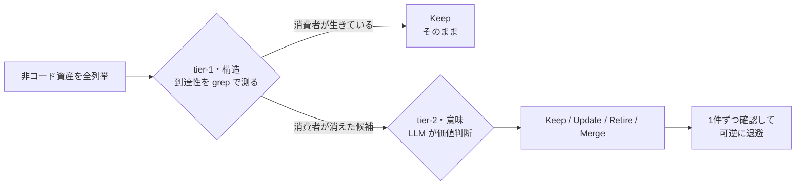
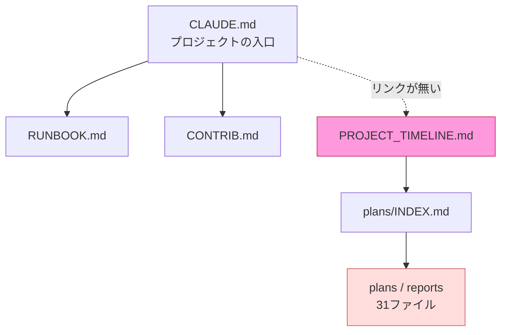

> **この記事でわかること**: リポジトリに溜まった「使われなくなった設定・死んだ workflow・誰も読まない runbook」を、**構造は grep、価値判断は LLM** の2段で棚卸しする方法。Claude Code スキルとして即導入できるほか、スキルを使わなくても同じパターンを手元で回せます。

## 前提

- **スキルとして使う場合**: git と、`~/.claude/skills/` への書き込み権限（Claude Code 環境）
- **手動で回す場合**: `grep` が使えるシェルと、任意の LLM（判断を任せる相手）
- 対象は「コードではないファイル」全般（設定・CI・docs・runbook など）。コードそのものの dead code 検出は対象外です

## AI エージェントと開発すると、コードじゃないものが溜まる

AI エージェントと開発していると、コード以外のファイルが静かに増えていきます。

- `PLAN_xxx.md` `HANDOFF_xxx.md` `PROGRESS_xxx.md` —— 一度書かれて二度と参照されない作業メモ
- 一時的に入れて外し忘れた linter やフォーマッタの設定ファイル
- `on:` が満たされず発火しない、あるいは発火しても `if: false` で全ジョブがスキップされる、実質何もしない GitHub Actions の workflow
- 記述対象のプロセスがとっくに終わっているのに残っている runbook

これらは「壊れて」はいません。YAML は妥当だし、Markdown も整形されています。だから linter は何も言いません。**linter が見るのは「構造的に正しいか」だけ**で、「このファイルはまだ存在に値するか」は測れないからです。

私が困っていたのもここでした。「参照されなくなった runbook や、機能しなくなった workflow を検出するスキルはないか」と探し始めて、最終的に自作したのが `repo-asset-stocktake` というスキルです。この記事では、その設計の核心（誰でも転用できる部分）と、実際に別リポジトリへ回して「孤立した文書の島」を見つけた話をします。

## 核心：構造は grep で、価値は LLM で

作る前に決定的だったのは、**チェックしたい性質が2種類に分かれる**と気づいたことです。

| 性質 | 例 | 何で判定するか |
|---|---|---|
| **構造的**（バイト列の形で決まる） | YAML が妥当か / リンク先が生きているか | **コード**（grep / parse）。100% 正確・即時 |
| **意味的**（意図の理解が要る） | この設定はまだ使われているか / この runbook はまだ実在するプロセスを書いているか | **LLM**（判断） |

「もう誰も走らせない `.textlintrc`」は、どのコードとも矛盾していません（構造的には健康）。でも価値はゼロです。この差は grep では埋まりません。

一方で、全ファイルにいきなり LLM を当てるのはコストの無駄です。そこで、**列挙はコード・判断は LLM** に割ります。



- **tier-1（コード）**: あとで説明する「到達性（reachability）」を grep で測り、怪しい候補だけに絞る
- **tier-2（LLM）**: 絞られた候補だけを「これはまだ意味があるか」で判断し、`Keep` / `Update` / `Retire` / `Merge` の判定を出す。数値スコアは付けません

### 到達性（reachability）とは

到達性とは「その資産を消費する何かが、まだ生きているか」です。**あらゆる非コード資産は、何かに消費されているから生きています。**

| 消費者のクラス | 資産の例 | 到達性チェック（grep でやること） |
|---|---|---|
| ツール起動 | `.textlintrc` などツール設定 | ツール名を `package.json` の scripts・pre-commit・Makefile・CI で検索。起動箇所ゼロ = 候補 |
| CI トリガー | `.github/workflows/*.yml` | 参照する script/action が実在するか、`on:` トリガーが到達可能か parse |
| 人間のナビゲーション | runbook / docs | 他の doc や README からの被リンクを検索。被リンクゼロ = 候補 |

たとえば「ツール起動」の到達性は、こう測れます。

```bash
# .textlintrc がまだ「起動」されているか（インストール済みかではなく）を見る
grep -rn "textlint" .github/workflows/ .pre-commit-config.yaml Makefile 2>/dev/null
# package.json は scripts の中だけを見る（devDependencies に名前があっても「起動」ではない）
jq -r '.scripts // {} | values[]' package.json 2>/dev/null | grep textlint
# → どちらも出力が無ければ「起動箇所ゼロ」= tier-2 に回す候補
```

この表とコマンドが、この記事でいちばん持ち帰ってほしい部分です。消費者のクラスごとに「消費のつながり（＝資産を呼ぶ側との結線）が切れていないか」を機械的に測れば、LLM に渡す前に候補を大きく絞れます。

### なぜ自作したか（既製品を探した結論）

:::details 「普通にそういうツールあるでしょ」を2回調べた結果
最初は「既製品があるはず」と思って探しました。結論はレイヤーで割れます。

- **構造チェックは既製品が豊富**。MegaLinter や super-linter が yamllint・actionlint・markdownlint 等を束ねています。YAML 妥当性は yamllint、dead-link は markdown-link-check や Lychee といった専用ツール（いずれも MegaLinter から呼べます）があり、自作する理由はありません。
- **意味的な「価値」レビューは既製品が薄い**。近いのは商用サービスの Dosu ですが、公開情報を見る限り docs とコードのズレ（drift）検出はその複数機能の一つで（Dosu 自体は issue のトリアージやエージェント向けナレッジ基盤をより広く訴求しています）、いずれにせよ「設定や workflow がまだ価値を持つか」を判定する仕組みではありません。

そして「LLM が資産を価値でレビューして Keep/Retire を出す」という仕組み自体は、私の Claude Code 環境の中に既に4回実装されていました（設定・ルール・スキル・プロジェクト docs、それぞれを対象にした棚卸しスキル。スキルを対象にした版の設計過程は[別記事](https://zenn.dev/shimo4228/articles/skill-stocktake-design-journey)に書いています）。**欠けていたのは仕組みではなく対象**でした。「プロジェクトリポジトリの非コード資産」に向けたものだけがありませんでした。だから、ゼロから発明せず、既存の棚卸しスキルの骨格を写して対象だけ差し替えました。
:::

構造チェックは既製 linter に任せ、**足りない「価値判断」の層だけを薄く自作する**——これが結論でした。

## 導入：Claude Code スキルとして

スキルは単独リポジトリで公開しています。`~/.claude/skills/` に置けば `/repo-asset-stocktake` で呼べます。

```bash
git clone https://github.com/shimo4228/repo-asset-stocktake \
  ~/.claude/skills/repo-asset-stocktake
```

実行は、監査したいリポジトリのパスを渡すだけです。

```text
/repo-asset-stocktake                  # 現在のディレクトリを監査
/repo-asset-stocktake ~/path/to/repo   # 別リポジトリを監査
```

判定結果は監査対象リポ内の `.repo-asset-stocktake.json` に台帳として残り、2回目以降は変更された資産だけを再評価できます。中身はこんな形です。

```json
{
  "evaluated_at": "2026-07-05T05:20:00Z",
  "assets": [
    {
      "path": "docs/plans/NEXT_STEPS_fsrs-migration.md",
      "consumer": "human-navigation",
      "reachability": "被リンク 0 / INDEX 未掲載",
      "verdict": "Retire",
      "reason": "対象機能は出荷済みなので『残り作業』メモが形骸化している"
    }
  ]
}
```

この台帳ファイルは `.gitignore` に足しておくと、公開リポでも監査結果を外に出さずに済みます。

## 実際に回したら「33ファイルの孤立した島」が出てきた

作った後、自分の別リポジトリ（iOS アプリ）へ回してみました。ここには CI の workflow もツール設定もほとんど無く、大半は Markdown の docs です。「じゃあ何も出ないだろう」と思ったら、逆でした。

出てきたのは個別のゴミファイルではなく、**構造**でした。



5ヶ月前の2週間の開発バーストで生まれた `PLAN` / `PROGRESS` / `HANDOFF` / `BUG` / `REVIEW` のスナップショットが、`docs/plans/` と `docs/reports/` に**31ファイル**溜まっていました。そこへの経路は「`PROJECT_TIMELINE.md` → `INDEX.md`」の1本だけ。ところがその `PROJECT_TIMELINE.md` 自身が `CLAUDE.md`（プロジェクトの入口）からリンクされていませんでした。入口の2ファイルを足すと、**計33ファイルが入口から到達不能**という状態です。

tier-1 の grep と tier-2 の LLM の分担が、ここでそのまま効きました。

- **tier-1（grep）**: 構造の事実を並べる —— 「`PROJECT_TIMELINE.md` の被リンク 0」「`INDEX.md` は plan 群をリンク」。橋が孤立していること自体は grep で出ます
- **tier-2（LLM）**: その事実を「島全体への唯一の橋が切れている＝入口を1本つなげば33ファイルが甦る」と解釈し、削除ではなく結線を選ぶ

検出は構造（tier-1）、意味づけは LLM（tier-2）。列挙と判断を分けた狙いが、この島でそのまま働きました。

対処は削除ではなく、**入口を1本結線する**ことでした。`CLAUDE.md` に `PROJECT_TIMELINE.md` へのリンクを1行足すだけで、33ファイルの履歴がまとめて救済されます。lint では絶対に出ない、価値レビューだからこそ出た結論でした。

### tier-2 が「削除」より価値を出した瞬間

このスキルでいちばん効いたのは、削除ではなく**削除の却下**でした。

tier-1 が、同名の `dead-code-analysis.md` を2つ見つけて「重複」候補に上げました。単純な basename の重複除去なら、ここで片方を消していたはずです。

ところが tier-2 が中身を比較すると、片方は Python の vulture による解析、もう片方は手動の Swift 解析で、**別物**でした。Merge すれば一方の分析が失われます。判定は「Merge をキャンセル」でした。構造のシグナルを意味の層が検証して覆す。これが2段に分けた狙いそのものです。

同じ要領で、`zenn-content` 側では別クラスの資産も拾いました。`.gitignore` が `archive/` を「公開しない」と宣言しているのに、ルール追加前にコミット済みの4ファイルが tracked のまま GitHub に公開され続けていた、という設定の意図と実態のズレです。同じスキルが、ツール設定・workflow・docs・VCS 設定と、消費者クラスの違う資産を横断して拾えます。

## スキルを使わなくても、このパターンは回せる

Claude Code のカスタムスキルを使わなくても、核は転用できます。手元のエージェント（あるいは手作業）で、次の順にやるだけです。

1. **列挙する（コード）**: 非コード資産を全部リストアップし、消費者クラスごとに到達性を grep で測る（上の「到達性とは」の表とコマンド）
2. **絞る**: 到達性ゼロ（起動箇所0 / 全参照 dead / 被リンク0）のものに加えて、「到達はするが怪しい」もの（更新が古い、`PLAN` / `HANDOFF` のような使い捨て文書、出荷済み機能の"残り作業"を書いている等）も候補に入れる —— 前章の島は被リンクがあっても形骸化していました
3. **判断する（LLM）**: 候補だけを「これはまだ意味があるか」で判断し、Keep / Update / Retire / Merge を出す
4. **可逆に消す**: Retire は即削除せず、`.disabled` へのリネームなど戻せる形で先に退避（soft-delete）し、1件ずつ確認する

:::message alert
最大の落とし穴は **「到達性ゼロ = 死んでいる」ではない** ことです。

このスキルを作ったとき、別モデル（Codex）によるレビューを並列でかけたら、自分（Claude）のレビューでは気づかなかった盲点を捕まえました。**消費が1段階間接だと grep が空振りする**ケースです。

- `lint-staged` 経由で呼ばれる prettier は、直接の起動箇所が無い
- リモートの `uses: owner/repo@ref` アクションは、ローカルに実体が無くても生きている
- `mkdocs.yml` のナビに載っている doc は、Markdown の被リンクが無くても到達できる
- `.claude/skills/*.md` は被リンク0でも、消費者は人間ではなく Claude Code のローダー

到達性ゼロは「削除候補」ではなく「**要調査**」として扱ってください。消費者を取り違えると、生きている資産を殺します。実際、この修正がなければ iOS リポの `.claude/skills/*.md` 9本を誤って Retire していました。
:::

## まとめ

- 非コード資産の**構造**（妥当性・dead-link）は既製 linter に任せる。自作しない
- **価値**（まだ存在に値するか）だけ、薄く LLM を重ねる。全件に当てず、grep で候補を絞ってから
- 消費者クラス（ツール起動 / CI トリガー / 人間ナビゲーション）ごとに到達性を測るのが、絞り込みの機械的な軸になる
- 到達性ゼロは「削除」ではなく「要調査」。間接消費を見落とすと live 資産を殺す
- 削除は必ず可逆に（`.disabled` 退避 → 1件ずつ確認）

lint が答えられるのは「このファイルは正しいか」まで。「このファイルはまだ要るか」は、意味の理解が要る別の問いです。そこだけを LLM に任せると、linter の網から漏れていた資産が見えてきます。

## 関連リンク

- スキル本体: [shimo4228/repo-asset-stocktake](https://github.com/shimo4228/repo-asset-stocktake)
- 姉妹スキルの設計過程: [AI の苦手な仕事をスクリプトに逃がす — スキル棚卸しコマンドの設計・実装・公開の全記録](https://zenn.dev/shimo4228/articles/skill-stocktake-design-journey)
- 著者のスキル・研究リポジトリ一覧: [github.com/shimo4228](https://github.com/shimo4228)
